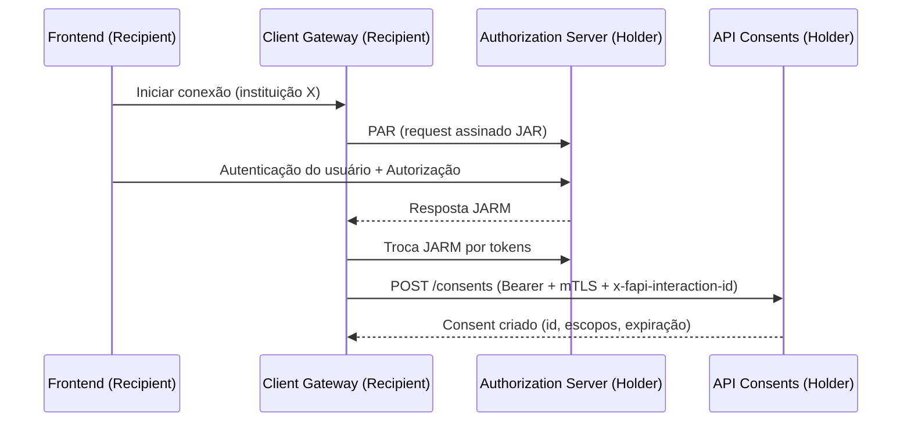

# Open Finance (Compartilhamento de Dados)

**Projeto-base para atuar como Transmissor (Data Holder) e Receptor (Data Recipient)**

**Stack priorizada:**
Java 25 · Spring Boot 3.x (Virtual Threads) · Keycloak (FAPI extensions) · PostgreSQL · MongoDB · Redis · AWS SNS/SQS · Kubernetes (EKS) · Terraform · Helm · OpenTelemetry · Prometheus/Datadog · Frontend: React

> **Fonte oficial:** Esta base segue as especificações publicadas na **Área do Desenvolvedor – Open Finance Brasil** (segurança FAPI-BR, DCR, requisitos não-funcionais, API Comum/Discovery, PCM). Onde houver metas regulatórias (prazos/limites), citamos explicitamente os trechos correspondentes. ([Banestes Developers][1])

---

## 0) Propósito

Consolidar a **documentação principal** e o **esqueleto técnico** para implementar **Open Finance – Compartilhamento de Dados** com capacidade de operar tanto como **Transmissor (Holder)** quanto **Receptor (Recipient)**.
A navegação será **progressiva**: este README traz a visão macro; cada camada/componente terá seu próprio guia em `docs/` e nas pastas de código.

---

## 1) Sumário

* [0) Propósito](#0-propósito)
* [2) Visão executiva do Open Finance](#2-visão-executiva-do-open-finance)
* [3) Ecossistema e componentes](#3-ecossistema-e-componentes)
* [4) O que é comum a Transmissor e Receptor](#4-o-que-é-comum-a-transmissor-e-receptor)
* [5) Arquitetura lógica (geral)](#5-arquitetura-lógica-geral)
* [6) Visão Transmissor (Holder)](#6-visão-transmissor-holder)
* [7) Visão Receptor (Recipient)](#7-visão-receptor-recipient)
* [8) Requisitos funcionais e não funcionais](#8-requisitos-funcionais-e-não-funcionais)
* [9) Padrões de Observabilidade, PCM e Segurança](#9-padrões-de-observabilidade-pcm-e-segurança)
* [10) Estrutura de diretórios](#10-estrutura-de-diretórios)
* [11) Como rodar (Dev) e como implantar (Cloud)](#11-como-rodar-dev-e-como-implantar-cloud)
* [12) Roadmap e marcos](#12-roadmap-e-marcos)
* [13) Glossário](#13-glossário)
* [Apêndices](#apêndices)

---

## 2) Visão executiva do Open Finance

* O **consentimento do cliente** é o gatilho: o usuário autoriza a instituição **Transmissora** a compartilhar dados com a **Receptora**.
* A segurança segue o **Perfil de Segurança FAPI-BR 1.0** com requisitos como **PAR**, **JAR/JARM**, **mTLS**, **`private_key_jwt`**, **escopos parametrizados** e **acr (LOA2 obrigatório, LOA3 recomendado)** no `id_token`. ([Open Finance Brasil][2])
* **DCR (Dynamic Client Registration)** é realizado com **SSA** emitido pelo **Diretório de Participantes**. ([Open Finance Brasil][3])
* A **API Comum (Discovery)** expõe **/status**, **/outages** e **/metrics** (de publicação obrigatória para todos os participantes). ([Open Finance Brasil][4])

---

## 3) Ecossistema e componentes

* **Diretório de Participantes**: registro/certificação do software, emissão de **SSA**, discovery de OPs/AS. ([Open Finance Brasil][3])
* **Authorization Server (AS/OP)**: conforme **FAPI-BR** – **PAR obrigatório**, **`private_key_jwt`**, **tokens de 300–900s**, **refresh tokens exigidos (sem rotação)**, metadados via **OpenID Discovery**. ([Open Finance Brasil][2])
* **APIs de Dados Cadastrais/Transacionais (DC)**: **Consents**, **Resources**, **Customers**, **Accounts**, etc.
* **API Comum/Discovery**: **/discovery/v2/status** (situação), **/discovery/v2/outages** (indisponibilidades planejadas), **/metrics** (desempenho de todas as APIs). ([Open Finance Brasil][4])
* **Plataforma de Coleta de Métricas (PCM)**: coleta/report via integrador central para promover ambiente equitativo e não discriminatório. ([Open Finance Brasil][5])
* **Cabeçalhos de correlação**: `x-fapi-interaction-id` é obrigatório nas requisições autenticadas e deve ser ecoado na resposta. ([Open Finance Brasil][6])

---

## 4) O que é comum a Transmissor e Receptor

* **FAPI-BR** ponta a ponta: PAR, JAR/JARM, `private_key_jwt`, mTLS (bound tokens), JOSE (`sig`/`enc`), `acr` em `id_token`. ([Open Finance Brasil][2])
* **DCR com SSA** em cada Transmissor-alvo. ([Open Finance Brasil][3])
* **Consent lifecycle**: criar → autorizar → consultar → revogar/expirar.
* **API Comum** publicada (Status, Outages, Métricas). ([Open Finance Brasil][4])
* **RNFs regulatórios**: p95 por classe de endpoint, disponibilidade diária/trimestral, timeout, limites de tráfego (TPM/TPS) e limites operacionais mensais. ([Open Finance Brasil][7])
* **Observabilidade e PCM**: exposição de métricas e envio periódico para a plataforma central. ([Open Finance Brasil][8])

---

## 5) Arquitetura lógica (geral)

```mermaid
flowchart TD
  subgraph Client[Cliente (Usuário)]
    UI[App Web/Mobile (React)]
  end

  subgraph Recipient[Receptor]
    RGW[Client Gateway<br/>(PAR/JAR/JARM, DCR)]
    RCONS[Consent Manager]
    RCOLL[Collectors/Normalizers]
    RDB[(PostgreSQL)]
    RMDB[(MongoDB)]
    RREDIS[(Redis)]
    REVT[(SNS/SQS)]
  end

  subgraph Holder[Transmissor]
    AS[Keycloak (FAPI)]
    HCONS[API Consents]
    HRES[API Resources]
    HCUST[API Customers]
    HACC[API Accounts]
    HDB[(PostgreSQL)]
    HMDB[(MongoDB)]
    HREDIS[(Redis)]
    HEVT[(SNS/SQS)]
  end

  subgraph Obs[Observabilidade & PCM]
    OTL[OpenTelemetry]
    PM[Prometheus / Datadog]
    PCM[PCM Exporter]
  end

  UI -->|Inicia Consent| RGW
  RGW -->|DCR (SSA)| AS
  RGW -->|POST /consents| HCONS
  UI -->|Auth & Autorização (AS)| AS
  RGW -->|Tokens| AS
  RCOLL -->|GET APIs DC| HRES
  RCOLL -->|GET Customers/Accounts| HCUST & HACC
  Recipient --> OTL
  Holder --> OTL
  OTL --> PM
  Recipient --> PCM
  Holder --> PCM
```

---

## 6) Visão Transmissor (Holder)

### Componentes

* **AS/OP (Keycloak + extensões FAPI)**: PAR obrigatório; autenticação do client via `private_key_jwt`; `acr` LOA2; access tokens 300–900s; refresh tokens **sem rotação**; OpenID Discovery/.well-known. ([Open Finance Brasil][2])
* **APIs DC (Spring Boot 3, Virtual Threads)**: `dc-consents-svc`, `dc-resources-svc`, `dc-customers-svc`, `dc-accounts-svc`.
* **Data Layer**: PostgreSQL (consents/auditoria), MongoDB (payloads versionados), Redis (JWKS cache, throttling, idempotência).
* **Eventos**: SNS/SQS — `consent.created/revoked`, `token.issued`, `data.requested`.
* **API Comum (Discovery)**: publicar `/status`, `/outages`, `/metrics`. ([Open Finance Brasil][4])
* **Observabilidade/PCM**: OTel (traces/logs/métricas) e export para PCM. ([Open Finance Brasil][8])

### Fluxo resumido

1. **DCR**: Receptor registra seu software no AS com **SSA** do Diretório; validações incluem **PS256 no SSA**, `iat` do SSA **≤ 5 minutos**, `jwks_uri` e `redirect_uris` segundo SSA. ([Open Finance Brasil][3])
2. **Consent**: `POST /consents` → redireciona usuário para autenticação/autorizar no AS (PAR/JAR/JARM). ([Open Finance Brasil][2])
3. **Tokens**: JARM → troca por tokens (TTL de acesso 300–900s). ([Open Finance Brasil][2])
4. **Dados**: Receptor consome **Resources/Customers/Accounts** com **`x-fapi-interaction-id` obrigatório** nas chamadas autenticadas. ([Open Finance Brasil][6])
5. **Status/Outages/Metrics**: publicar e manter atualizados nos endpoints de **Discovery**. ([Open Finance Brasil][4])

---

## 7) Visão Receptor (Recipient)

### Componentes

* **Frontend (React)**: fluxo “Conectar instituição”, gestão de consentimentos, revogação/expiração.
* **Client Gateway**: DCR (SSA), PAR/JAR/JARM, mTLS, `private_key_jwt`, troca de tokens, gerenciamento de consent. ([Open Finance Brasil][2])
* **Collectors/Normalizers**: agendadores e workers (SQS) para coleta paginada e normalização.
* **Data Layer**: PostgreSQL (consents/conexões/auditoria), MongoDB (snapshots de dados), Redis (discovery/JWKS cache, throttling).
* **Eventos**: `data.fetched`, `data.normalized`, `consent.expiring`.
* **Observabilidade/PCM**: mesmos padrões do Holder; reporta métricas no formato exigido. ([Open Finance Brasil][8])

### Fluxo resumido

1. **DCR** com cada Transmissor-alvo via SSA. ([Open Finance Brasil][3])
2. **Criar consent** → redirecionar usuário para autenticação/autorizar. ([Open Finance Brasil][2])
3. **Trocar JARM por tokens** e agendar coletas (uso de `x-fapi-interaction-id`). ([Open Finance Brasil][9])
4. **Coleta**: paginação + retry com backoff; **`pagination-key`** para não contar rechamadas em limites operacionais. ([Open Finance Brasil][6])
5. **Relatórios/Alertas**: expiração de consent, revalidação periódica.

---

## 8) Requisitos funcionais e não funcionais

### 8.1 Funcionais (mínimos)

* **[DC] Consents** — criar, consultar, revogar; auditoria/expiração.
* **[DC] Resources/Customers/Accounts** — leitura conforme OAS, paginação, versionamento.
* **DCR/SSA** — registro dinâmico com validações formais no AS. ([Open Finance Brasil][3])
* **FAPI-BR** — PAR, JAR/JARM, `private_key_jwt`, mTLS, acr no `id_token`. ([Open Finance Brasil][2])
* **Discovery** — publicar **/status**, **/outages**, **/metrics**. ([Open Finance Brasil][4])
* **`x-fapi-interaction-id`** — obrigatório nas chamadas autenticadas (ecoar na resposta). ([Open Finance Brasil][6])

### 8.2 Não funcionais — **metas regulatórias e operacionais**

**Desempenho (p95 por classe de endpoint)**

* **Alta** e **Média-alta**: **≤ 1.500 ms**
* **Média**: **≤ 2.000 ms**
* **Baixa**: **≤ 4.000 ms**. ([Open Finance Brasil][7])

**Disponibilidade**

* **≥ 95%** por janela de **24h** e **≥ 99,5%** por **3 meses**. Aferição via **GET `/discovery/status`** a cada **30 s** (timeout **1 s**) com estados **OK**, **PARTIAL_FAILURE**, **SCHEDULED_OUTAGE**, **UNAVAILABLE**. ([Open Finance Brasil][10])

**Timeout**

* **15 s** (server-side) e uso de **HTTP 504** em estouro. ([Open Finance Brasil][11])

**Limites de tráfego**

* **TPM (por origem)**: regras por classe (alta frequência dependente de QCA/consentimentos ativos; média-alta 2.000 TPM; média 1.500 TPM; baixa 1.000 TPM). **HTTP 429** quando excedido; requisições acima do limite não entram no cálculo de performance. ([Open Finance Brasil][12])
* **TPS global**: capacidade **mínima de 300 TPS simultâneos** (exclui chamadas internas). Ao atingir o limite, **aumentar +150 TPS**; uso de **HTTP 529** (“site is overloaded”). ([Open Finance Brasil][12])

**Limites operacionais (mensais, por endpoint/cliente/recurso)**

* **Baixa**: 8 chamadas/mês
* **Média**: 30 chamadas/mês
* **Média-alta**: 120 chamadas/mês
* **Alta**: 240 chamadas/mês
* **Contas: saldos/limites**: **420 chamadas/mês**
* Apenas **2xx** contam; **`x-fapi-interaction-id` obrigatório**; **`pagination-key`** evita contar rechamadas. **HTTP 423** ao exceder. ([Open Finance Brasil][6])

> **SLOs internos sugeridos (além do regulatório):** p99 e metas de erro 5xx por API podem ser definidos por produto/carga. (Use estes como *objetivos internos*, não regulatórios.)

---

## 9) Padrões de Observabilidade, PCM e Segurança

### 9.1 Observabilidade

* **Traces** com OpenTelemetry (propagação W3C). Correlacione `x-fapi-interaction-id` em spans.
* **Métricas**: RPS, p50/p95/p99, erro por endpoint, timeouts, filas SQS, cache hit/miss.
* **Logs** JSON estruturados (`requestId`, `consentId`, `clientId`, `softwareId`, `jti`), sem dados sensíveis.

### 9.2 PCM (Plataforma de Coleta de Métricas)

* Reportar **disponibilidade**, **erros por código**, **latência** por endpoint e **volumes** conforme a documentação oficial (há documentação funcional, técnica, API e manual de integração). Recomenda-se **exportador dedicado** com reenvio resiliente e **DLQ**. ([Open Finance Brasil][8])

### 9.3 Segurança (FAPI-BR resumido)

* **AS deve**: exigir **PAR**, **`private_key_jwt`**, publicar metadados via **OpenID Discovery**, suportar `claims`, **acr LOA2 (LOA3 recomendado)**, implementar `userinfo`, `consent` parametrizado; **emitir access tokens com 300–900s**; **não rotacionar refresh tokens**. ([Open Finance Brasil][2])
* **DCR/SSA**: conexão mTLS com certificados ICP; **SSA PS256**; **`iat` SSA ≤ 5 min**; validação de `jwks_uri`/`redirect_uris`. ([Open Finance Brasil][3])
* **Cabeçalhos**: **`x-fapi-interaction-id` obrigatório** em chamadas autenticadas e ecoado na resposta. ([Open Finance Brasil][6])

---

## 10) Estrutura de diretórios

```text
.
├─ apps/
│  ├─ common/
│  │  ├─ auth-broker/               # libs/SDK p/ AS/Keycloak, JOSE, mTLS helpers
│  │  ├─ directory-connector/       # integração c/ Diretório, SSA, DCR helpers
│  │  ├─ consent-core/              # lifecycle de consent (policies, expirations)
│  │  ├─ data-access-gateway/       # valida token/escopo/consentId; roteia p/ DC
│  │  └─ observability/             # OTel autoconfig, correlation, métricas padrão
│  ├─ holder/
│  │  ├─ dc-consents-svc/
│  │  ├─ dc-resources-svc/
│  │  ├─ dc-customers-svc/
│  │  ├─ dc-accounts-svc/
│  │  └─ dc-quotas-svc/             # rate-limit/quotas por client/softwareId
│  ├─ recipient/
│  │  ├─ client-gateway/
│  │  ├─ collector-scheduler/
│  │  ├─ collector-worker/
│  │  ├─ normalizer/
│  │  ├─ consent-monitor/
│  │  └─ frontend/                  # React (UI consent/dados)
│  └─ tools/
│     └─ pcm-exporter/
├─ deploy/
│  ├─ terraform/                    # EKS, RDS, ElastiCache, VPC, etc.
│  ├─ helm/                         # charts por serviço + values por ambiente
│  └─ pipelines/                    # CI/CD (build, testes, conformidade, deploy)
├─ docs/
│  ├─ 00-overview.md                # visão geral
│  ├─ 10-common/                    # documentação da camada comum
│  │  ├─ keycloak-fapi.md
│  │  ├─ dcr-ssa.md
│  │  ├─ observability.md
│  │  └─ pcm.md
│  ├─ 20-holder/                    # documentação visão Transmissor
│  │  ├─ apis-dc-consent.md
│  │  ├─ apis-dc-customers.md
│  │  ├─ apis-dc-accounts.md
│  │  └─ data-model.md
│  ├─ 30-recipient/                 # documentação visão Receptor
│  │  ├─ dcr-client.md
│  │  ├─ collectors.md
│  │  ├─ normalization.md
│  │  └─ frontend.md
│  └─ 90-adr/                       # Architecture Decision Records
│     └─ ADR-0001-fapi-keycloak.md
└─ README.md                        # este documento
```

> **Evolução documental**: cada arquivo em `docs/` aprofunda a camada/componente seguindo o formato: *Objetivo → Responsabilidades → Contratos (OAS) → Configs → Métricas → Testes → Runbook*.
> Teremos três “ramos” principais: **comum** (`docs/10-common`), **transmissor** (`docs/20-holder`) e **receptor** (`docs/30-recipient`), cada qual com documentação de seus componentes.

---

## 11) Como rodar (Dev) e como implantar (Cloud)

### 11.1 Requisitos

* JDK **25**, Maven 3.9+
* Docker/Docker Compose
* Node 20+ (frontend)
* kubectl, Helm, Terraform (para Cloud)

### 11.2 Desenvolvimento local

1. **Infra local** (compose): Postgres, Mongo, Redis, Keycloak.

```bash
docker compose -f deploy/compose/dev.yml up -d
```

2. **Variáveis de ambiente** (exemplo):

```bash
export SPRING_PROFILES_ACTIVE=dev
export OIDC_ISSUER_URI=https://keycloak.local/realms/ofb
export MTLS_KEYSTORE_PATH=certs/client-keystore.p12
export MTLS_TRUSTSTORE_PATH=certs/truststore.p12
export DATASOURCE_URL=jdbc:postgresql://localhost:5432/ofb
```

3. **Build & Test**

```bash
mvn -q -T1C clean verify
```

4. **Executar serviços** (exemplos)

```bash
(cd apps/holder/dc-consents-svc && mvn spring-boot:run)
(cd apps/recipient/client-gateway && mvn spring-boot:run)
(cd apps/recipient/frontend && npm i && npm run dev)
```

### 11.3 Implantação (EKS)

1. **Terraform** (provisionamento)

```bash
cd deploy/terraform/envs/prod
terraform init && terraform apply
```

2. **Helm** (deploy por serviço)

```bash
helm upgrade --install dc-consents-svc deploy/helm/dc-consents-svc -f deploy/helm/values/prod.yaml
```

3. **Observabilidade**

* OTel Collector como DaemonSet.
* Datadog Agent (ou Prometheus Operator) com autodiscovery.

4. **Segurança & Certificados**

* Ingress com mTLS (cadeia ICP-Brasil) e rotação automatizada. ([Open Finance Brasil][3])

---

## 12) Roadmap e marcos

**M0 — Fundações (Segurança/Infra/Consent)**

* Keycloak conforme FAPI-BR (PAR/JAR/JARM, `private_key_jwt`)
* DCR Client (SSA) + `dc-consents-svc` (Holder)
* Observabilidade básica + dashboards p95 (por classe) e p99 internos

**M1 — Dados essenciais**

* `dc-customers-svc` e `dc-accounts-svc` (Holder)
* Recipient: `client-gateway`, `collector-scheduler`, `collector-worker`
* PCM Exporter (mínimo viável)

**M2 — Robustez e conformidade**

* Normalization + versionamento de OAS
* Quotas/rate-limit por client (Holder)
* Suites de conformidade BR-OB (RP/OP/DCR) no CI/CD; certificados de conformidade funcional. ([Open Finance Brasil][13])

---

## 13) Glossário

* **Transmissor (Holder)**: expõe dados padronizados mediante consentimento.
* **Receptor (Recipient)**: consome dados autorizados pelo cliente.
* **DCR**: Dynamic Client Registration (com **SSA** do Diretório). ([Open Finance Brasil][3])
* **FAPI (BR)**: perfil de segurança (PAR/JAR/JARM, mTLS, JOSE, `private_key_jwt`, acr). ([Open Finance Brasil][2])
* **PCM**: Plataforma de Coleta de Métricas (regulatória). ([Open Finance Brasil][8])
* **`x-fapi-interaction-id`**: UUID RFC4122 de correlação request/response, obrigatório em chamadas autenticadas. ([Open Finance Brasil][6])

---

## Apêndices

### A — Sequência de Consentimento (exemplo)



### B — RNFs regulatórios (resumo operacional)

* **p95**: 1.500ms (alta/média-alta), 2.000ms (média), 4.000ms (baixa). ([Open Finance Brasil][7])
* **Disponibilidade**: 95% diário; 99,5% trimestral; aferição via **/discovery/status** a cada 30s (timeout 1s). ([Open Finance Brasil][10])
* **Timeout**: 15s (HTTP 504 em estouro). ([Open Finance Brasil][11])
* **TPM** por classe (alta com tabela por QCA; média-alta 2.000; média 1.500; baixa 1.000). **HTTP 429** ao exceder. ([Open Finance Brasil][12])
* **TPS global**: 300 TPS (mínimo), com gatilho de +150 TPS; **HTTP 529** ao exceder. ([Open Finance Brasil][12])
* **Limites operacionais**: 8/30/120/240 e 420 (saldos/limites de contas); **HTTP 423** ao exceder; **`pagination-key`** para não contar rechamadas; **`x-fapi-interaction-id` obrigatório**. ([Open Finance Brasil][6])

### C — Esqueletos de configuração

**Spring Boot (`application.yaml`) — serviços DC**

```yaml
server:
  port: 8080
  virtualThreads:
    enabled: true

management:
  endpoints:
    web:
      exposure:
        include: health,info,prometheus
  tracing:
    enabled: true

security:
  mtls:
    key-store: ${MTLS_KEYSTORE_PATH}
    trust-store: ${MTLS_TRUSTSTORE_PATH}

oauth2:
  resource-server:
    jwt:
      issuer-uri: ${OIDC_ISSUER_URI}
      jwk-set-uri: ${OIDC_JWKS_URI}

fapi:
  require-par: true
  require-jarm: true
```

**Helm (valores mínimos)**

```yaml
replicaCount: 3
resources:
  requests: { cpu: "200m", memory: "512Mi" }
  limits:   { cpu: "1", memory: "1Gi" }

autoscaling:
  enabled: true
  targetCPUUtilizationPercentage: 60
  behavior:
    scaleDown:
      stabilizationWindowSeconds: 300

env:
  - name: OIDC_ISSUER_URI
    valueFrom: { secretKeyRef: { name: ofb-secrets, key: OIDC_ISSUER_URI } }

podAnnotations:
  instrumentation.opentelemetry.io/inject-java: "true"
```

---

### D — Como esta documentação evolui

* **Troncos documentais**:

  * `docs/10-common/*` — FAPI/Keycloak, DCR/SSA, Discovery/PCM, Observabilidade.
  * `docs/20-holder/*` — APIs DC (Consent/Customers/Accounts), modelos de dados, runbooks.
  * `docs/30-recipient/*` — DCR Client, agendadores/coleta, normalização, frontend.
* **Por componente**: cada serviço em `apps/*/*` terá `README.md` próprio (*Resumo → Contratos (OAS) → Config → Observabilidade → Testes → Operação (Runbook)*).
* **ADRs** em `docs/90-adr/` para decisões (ex.: “Keycloak como OP FAPI”, “Virtual Threads habilitadas”, “Estratégia de quotas/limites”, etc.).

---

[1]: https://desenvolvedores.banestes.com.br/api-portal/pt-br/content/api-payment-initiation-open-banking-brasil?utm_source=chatgpt.com "API Payment Initiation - Open Banking Brasil"
[2]: https://openfinancebrasil.atlassian.net/wiki/spaces/OF/pages/245694465 "[PT] Open Finance Brasil Financial-grade API Security Profile 1.0 Implementers Draft 3 - Área do Desenvolvedor - Open Finance Brasil - Área do Desenvolvedor"
[3]: https://openfinancebrasil.atlassian.net/wiki/spaces/OF/pages/246054957/PT%2BOpen%2BFinance%2BBrasil%2BFinancial-grade%2BAPI%2BDynamic%2BClient%2BRegistration%2B2.0%2BRC1%2BImplementers%2BDraft%2B3 "[PT]  Open Finance Brasil Financial-grade API Dynamic Client Registration 2.0 RC1 Implementers Draft 3 - Área do Desenvolvedor - Open Finance Brasil - Área do Desenvolvedor"
[4]: https://openfinancebrasil.atlassian.net/wiki/spaces/OF/pages/429654037/Informa%2Bes%2BGerais%2B-%2BAPI%2BComum%2BDiscovery%2B-%2Bv2.0.1 "Informações Gerais - API Comum (Discovery) -  v2.0.1 - Área do Desenvolvedor - Open Finance Brasil - Área do Desenvolvedor"
[5]: https://openfinancebrasil.atlassian.net/wiki/spaces/OF/pages/37945356?utm_source=chatgpt.com "Área do Desenvolvedor"
[6]: https://openfinancebrasil.atlassian.net/wiki/spaces/OF/pages/17924220/Limites%2Boperacionais "Limites operacionais - Área do Desenvolvedor - Open Finance Brasil - Área do Desenvolvedor"
[7]: https://openfinancebrasil.atlassian.net/wiki/spaces/OF/pages/17891396/Desempenho "Desempenho - Área do Desenvolvedor - Open Finance Brasil - Área do Desenvolvedor"
[8]: https://openfinancebrasil.atlassian.net/wiki/spaces/OF/pages/17378055/Plataforma%2Bde%2BColeta%2Bde%2BM%2Btricas?utm_source=chatgpt.com "Área do Desenvolvedor"
[9]: https://openfinancebrasil.atlassian.net/wiki/spaces/OF/pages/37879861/Reporte?utm_source=chatgpt.com "Fluxo - Espaços - Open Finance Brasil - Área do Desenvolvedor"
[10]: https://openfinancebrasil.atlassian.net/wiki/spaces/OF/pages/17891406/Disponibilidade "Disponibilidade - Área do Desenvolvedor - Open Finance Brasil - Área do Desenvolvedor"
[11]: https://openfinancebrasil.atlassian.net/wiki/spaces/OF/pages/17891413/Timeout "Timeout - Área do Desenvolvedor - Open Finance Brasil - Área do Desenvolvedor"
[12]: https://openfinancebrasil.atlassian.net/wiki/spaces/OF/pages/17989722/Limites%2Bde%2Btr%2Bfego "Limites de tráfego - Área do Desenvolvedor - Open Finance Brasil - Área do Desenvolvedor"
[13]: https://openfinancebrasil.org.br/certificado-de-conformidade/?utm_source=chatgpt.com "Certificado de conformidade"
