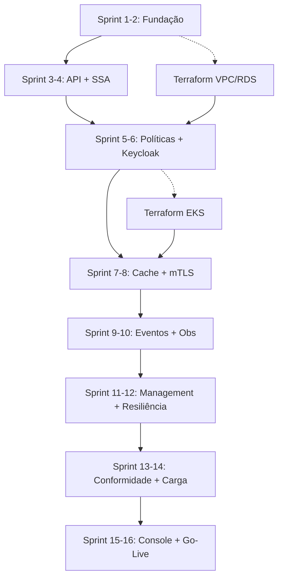

# Diagrama de Gantt — DCR Enterprise

> Cronograma visual completo do projeto (16 semanas)

---

## 📅 Visão Geral do Projeto

**Início**: Semana 1  
**Término**: Semana 16  
**Total de Sprints**: 8 (2 semanas cada)  
**Metodologia**: Desenvolvimento iterativo com entregas incrementais

---

## 📊 Diagrama de Gantt

### Legenda
- `█████` Trabalho ativo
- `▓▓▓▓▓` Trabalho paralelo possível
- `░░░░░` Fase de validação/testes
- `[M]` Marco importante (milestone)

---

### Fases e Entregas

```
SEMANA:     1    2    3    4    5    6    7    8    9   10   11   12   13   14   15   16
            ├────┼────┼────┼────┼────┼────┼────┼────┼────┼────┼────┼────┼────┼────┼────┤

═══════════════════════════════════════════════════════════════════════════════════════════
FASE 0: FUNDAÇÃO
═══════════════════════════════════════════════════════════════════════════════════════════
Setup Repo      █████                                                                        [M1]
Docker Compose  █████                                                                        
Keycloak Local  ██████                                                                       
Certificados    ██████                                                                       
Decisões Stack  █████░                                                                       

═══════════════════════════════════════════════════════════════════════════════════════════
FASE 1: MVP BACKEND
═══════════════════════════════════════════════════════════════════════════════════════════
Projeto Java         ████████                                                               
Validação SSA             ████████                                                          [M2]
Políticas FAPI                 ████████                                                     
Postgres Schema       ████████                                                              
API POST /register         ████████░                                                        
Testes Unitários           ████████░                                                        

═══════════════════════════════════════════════════════════════════════════════════════════
FASE 2: INFRAESTRUTURA CORE
═══════════════════════════════════════════════════════════════════════════════════════════
Terraform VPC       ▓▓▓▓▓▓▓▓                                                               
Terraform RDS            ████████                                                           
Terraform EKS                 ████████                                                      [M3]
Terraform Redis               ████████                                                      
Helm Charts                        ████████                                                 
Pipeline CI/CD                     ████████░                                                
OpenTelemetry                           ████████                                            

═══════════════════════════════════════════════════════════════════════════════════════════
FASE 3: INTEGRAÇÕES CRÍTICAS
═══════════════════════════════════════════════════════════════════════════════════════════
Keycloak Admin API               ████████                                                   [M4]
Cache Redis                           ████████                                              
Idempotência (jti)                    ████████                                              
API Gateway mTLS                           ████████                                         
Binding Cert                               ████████                                         
SNS/SQS Events                                  ████████                                    
S3 WORM Audit                                   ████████░                                   

═══════════════════════════════════════════════════════════════════════════════════════════
FASE 4: HARDENING & COMPLIANCE
═══════════════════════════════════════════════════════════════════════════════════════════
GET/PUT/DELETE                                       ████████                               
Circuit Breaker                                           ████████                          
Retry Policies                                            ████████                          
HPA + PDB                                                      ████████                     
Network Policy                                                 ████████                     
Testes FAPI-BR                                                      ████████░              [M5]
Testes Carga                                                        ████████░              
Pen Test                                                                 ████░             

═══════════════════════════════════════════════════════════════════════════════════════════
FASE 5: GO-LIVE
═══════════════════════════════════════════════════════════════════════════════════════════
Console React                                                                ████████       
Runbooks                                                                     ████████       
Docs Finais                                                                      ████████   
Infra Produção                                                                   ████████   [M6]
Treinamento Ops                                                                      ████   
Go-Live                                                                                  █  [M7]

═══════════════════════════════════════════════════════════════════════════════════════════
```

---

## 🎯 Marcos (Milestones)

| Marco | Semana | Descrição | Critérios de Aceitação |
|-------|--------|-----------|------------------------|
| **M1** | 2 | Ambiente Local Pronto | Docker Compose funcionando, Keycloak configurado |
| **M2** | 4 | Validação SSA Completa | SSA validado com assinatura PS256, claims verificados |
| **M3** | 6 | EKS Cluster Provisionado | Kubernetes rodando, pods deployados |
| **M4** | 8 | Integração Keycloak | Clientes criados via Admin API com sucesso |
| **M5** | 14 | Conformidade FAPI-BR | Todos os testes de conformidade passando |
| **M6** | 16 | Ambiente Produção | Infra PRD provisionada e validada |
| **M7** | 16 | Go-Live | Sistema em produção com monitoramento ativo |

---

## 📋 Detalhamento por Sprint

### Sprint 1-2: Fundação (Semanas 1-2)

```
Atividade                    S1  S2
─────────────────────────────────────
Setup Repositório            ██  
Estrutura Java                ████
Docker Compose (PG/Redis)    ████
Keycloak Local Setup         ████
Certificados mTLS            ████
Decisões Arquiteturais       ████░
```

**Entregáveis:**
- ✅ Repositório Git estruturado
- ✅ Docker Compose funcional
- ✅ Keycloak realm configurado
- ✅ Certificados auto-assinados gerados

---

### Sprint 3-4: API e Validação SSA (Semanas 3-4)

```
Atividade                    S3  S4
─────────────────────────────────────
Controller POST /register    ██  
Validação SSA Assinatura     ████
Validação Claims SSA         ████
Repository Postgres          ████
Mock JWKS Diretório          ████
Testes Unitários             ████░
Terraform VPC                ████
Terraform RDS                  ████
```

**Entregáveis:**
- ✅ Endpoint `POST /register` funcional
- ✅ SSA validado (assinatura + claims)
- ✅ Persistência em Postgres
- ✅ VPC + RDS provisionados

---

### Sprint 5-6: Políticas FAPI-BR e Keycloak (Semanas 5-6)

```
Atividade                    S5  S6
─────────────────────────────────────
Policy Engine FAPI-BR        ████
Validação jwks_uri           ██  
Validação grant_types        ██  
Cliente Keycloak Admin       ████
Mapper DTO → Keycloak        ████
Terraform EKS                ████
Terraform Redis              ████
Helm Charts Base               ████
Pipeline CI/CD                 ████░
```

**Entregáveis:**
- ✅ Políticas FAPI-BR aplicadas
- ✅ Integração Keycloak Admin API
- ✅ EKS + Redis provisionados
- ✅ Helm charts criados

---

### Sprint 7-8: Cache, Idempotência e mTLS (Semanas 7-8)

```
Atividade                    S7  S8
─────────────────────────────────────
Cache Redis (JWKS)           ██  
Idempotência (jti)           ████
Rate Limiting                ████
Logs Estruturados            ████
API Gateway (mTLS)           ████
Truststore ICP               ██  
Extração Headers Cert        ████
Binding Cert → Client          ████
Testes mTLS E2E                ████░
```

**Entregáveis:**
- ✅ Cache Redis funcionando
- ✅ Idempotência por JTI
- ✅ API Gateway com mTLS
- ✅ Binding de certificados

---

### Sprint 9-10: Eventos, Auditoria e Observabilidade (Semanas 9-10)

```
Atividade                    S9  S10
──────────────────────────────────────
OpenTelemetry Traces         ████
Métricas Customizadas        ████
Correlação trace_id          ██  
SNS Publisher                ████
SQS → S3 WORM Processor      ████
Formato Auditoria            ████
Dashboards Grafana/Datadog     ████
Alertas Básicos                ████░
```

**Entregáveis:**
- ✅ OpenTelemetry integrado
- ✅ SNS/SQS funcionando
- ✅ Auditoria em S3 WORM
- ✅ Dashboards básicos

---

### Sprint 11-12: DCR Management e Resiliência (Semanas 11-12)

```
Atividade                    S11 S12
──────────────────────────────────────
GET /register/{id}           ██  
PUT /register/{id}           ████
DELETE /register/{id}        ████
Validação RAT                ████
Circuit Breaker              ████
Retry Policies               ██  
HPA (Autoscaling)            ████
PodDisruptionBudget          ██  
NetworkPolicy                  ████
Testes Failover                ████░
```

**Entregáveis:**
- ✅ CRUD completo de clientes
- ✅ Resiliência (circuit breaker, retry)
- ✅ HPA + PDB configurados
- ✅ Network policies

---

### Sprint 13-14: Conformidade e Testes de Carga (Semanas 13-14)

```
Atividade                    S13 S14
──────────────────────────────────────
Ajustes Conformidade FAPI    ████
Suite Testes Conformidade    ████
Testes RFC 7591/7592         ████
Scripts K6 (Carga)           ████
Execução Testes Carga        ████
Análise e Tuning             ████
Ambiente QA Completo         ████
Pen Test Preparação            ████
Pen Test Execução              ████░
```

**Entregáveis:**
- ✅ Conformidade FAPI-BR validada
- ✅ Testes de carga (50 rps)
- ✅ Ambiente QA estável
- ✅ Vulnerabilidades remediadas

---

### Sprint 15-16: Console e Go-Live (Semanas 15-16)

```
Atividade                    S15 S16
──────────────────────────────────────
Console React (UI)           ████
Testes E2E Console           ████
Runbooks Operacionais        ████
Docs Operação Completa       ████
Infra Produção (Terraform)   ████
Migração Dados (se aplicável)████
Treinamento Time Ops         ████
Smoke Tests PRD                ████
Go-Live Controlado               ██
Monitoramento 24/7               ██
```

**Entregáveis:**
- ✅ Console React funcional
- ✅ Runbooks completos
- ✅ Produção provisionada
- ✅ Sistema em produção

---

## 🔄 Dependências Críticas

### Fluxo de Dependências



### Dependências por Componente

| Componente | Depende De | Bloqueia |
|------------|------------|----------|
| Validação SSA | Ambiente local, JWKS mock | Políticas FAPI-BR |
| Keycloak Admin API | Validação SSA, Políticas | Cache, mTLS binding |
| API Gateway mTLS | EKS, Certificados | Testes E2E |
| SNS/SQS | mTLS, OpenTelemetry | Auditoria S3 |
| Conformidade | Todos os anteriores | Go-live |

---

## ⚡ Trabalho Paralelo Possível

### Sprints 3-4
- Backend (API + SSA) pode ser desenvolvido **em paralelo** com:
  - Terraform VPC/RDS
  - Estrutura Helm Charts

### Sprints 5-6
- Backend (Políticas) pode ser desenvolvido **em paralelo** com:
  - Terraform EKS
  - Terraform Redis
  - Pipeline CI/CD

### Sprints 7-8
- Backend (Cache) pode ser desenvolvido **em paralelo** com:
  - API Gateway mTLS
  - Testes de integração

### Sprints 9-10
- Backend (Eventos) pode ser desenvolvido **em paralelo** com:
  - OpenTelemetry
  - Dashboards

---

## 📊 Alocação de Esforço (%)

```
Área                          % Total    Horas Est.
─────────────────────────────────────────────────
Backend (DCR Service)           40%        ~320h
Infraestrutura (Terraform/K8s)  30%        ~240h
Integração (Keycloak/Redis)     15%        ~120h
Testes e Qualidade              10%         ~80h
Documentação e Operação          5%         ~40h
─────────────────────────────────────────────────
TOTAL                          100%        ~800h
```

---

## 🎯 Caminho Crítico

O **caminho crítico** do projeto (atividades que não podem atrasar):

1. **Semanas 1-2**: Setup ambiente local → Keycloak configurado
2. **Semanas 3-4**: Validação SSA completa
3. **Semanas 5-6**: Integração Keycloak Admin API
4. **Semanas 7-8**: API Gateway mTLS configurado
5. **Semanas 9-10**: Auditoria S3 WORM funcionando
6. **Semanas 13-14**: Conformidade FAPI-BR validada
7. **Semanas 15-16**: Produção provisionada

⚠️ **Qualquer atraso nestas atividades impacta a data de go-live!**

---

## 📅 Datas de Entrega (Exemplo)

Assumindo início em **11 de novembro de 2025**:

| Sprint | Semanas | Data Início | Data Fim | Milestone |
|--------|---------|-------------|----------|-----------|
| 1 | 1-2 | 11/Nov/2025 | 24/Nov/2025 | M1: Ambiente Local |
| 2 | 3-4 | 25/Nov/2025 | 08/Dez/2025 | M2: SSA Validado |
| 3 | 5-6 | 09/Dez/2025 | 22/Dez/2025 | M3: EKS Provisionado |
| 4 | 7-8 | 23/Dez/2025 | 05/Jan/2026 | M4: Keycloak Integrado |
| 5 | 9-10 | 06/Jan/2026 | 19/Jan/2026 | - |
| 6 | 11-12 | 20/Jan/2026 | 02/Fev/2026 | - |
| 7 | 13-14 | 03/Fev/2026 | 16/Fev/2026 | M5: Conformidade OK |
| 8 | 15-16 | 17/Fev/2026 | 02/Mar/2026 | M7: Go-Live |

**Data estimada de go-live: 2 de março de 2026**

---

## 🔍 Monitoramento do Progresso

### Métricas de Acompanhamento

- **Burndown por sprint**: story points ou horas completadas
- **Velocity**: média de entrega por sprint
- **Bloqueios**: número de impedimentos ativos
- **Testes**: % de cobertura de código
- **Qualidade**: bugs encontrados vs. resolvidos

### Rituais Ágeis

| Ritual | Frequência | Duração |
|--------|-----------|---------|
| Daily Standup | Diária | 15 min |
| Sprint Planning | Início de sprint | 4h |
| Sprint Review | Fim de sprint | 2h |
| Sprint Retrospective | Fim de sprint | 1.5h |
| Refinamento | Meio do sprint | 2h |

---

## 📚 Documentação Relacionada

- [Plano de Desenvolvimento Detalhado](DEVELOPMENT_PLAN.md)
- [Resumo Executivo](EXECUTIVE_SUMMARY.md)
- [Guia de Início Rápido](QUICKSTART.md)

---

**Mantido por**: Time DCR Enterprise  
**Última atualização**: 8 de novembro de 2025  
**Versão**: 1.0
