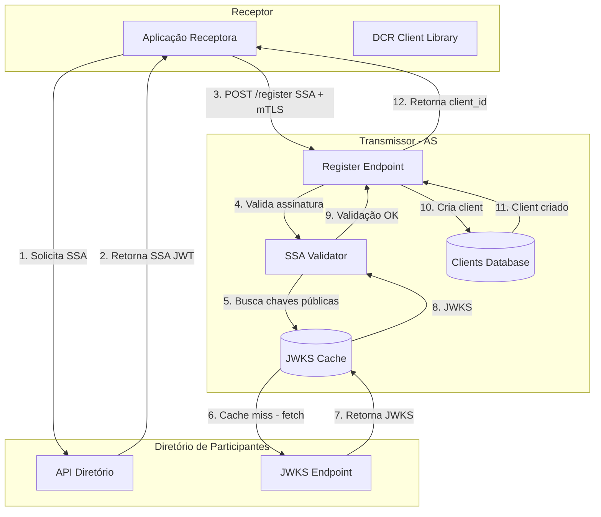
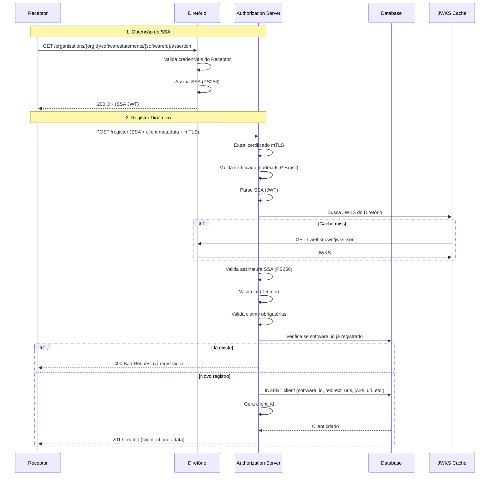

# Dynamic Client Registration (DCR) e Software Statement Assertion (SSA)

## 1. Objetivo

Este documento detalha a implementação do **Dynamic Client Registration (DCR)** conforme especificado no **[PT] Open Finance Brasil Financial-grade API Dynamic Client Registration 2.0**, incluindo:

- Registro dinâmico de clients OAuth2/OIDC
- Validação de Software Statement Assertion (SSA)
- Atualização e consulta de clients registrados
- Revogação de registros
- Integração com o Diretório de Participantes do Open Finance Brasil

---

## 2. Conceitos Fundamentais

### 2.1 Software Statement Assertion (SSA)

O **SSA** é um **JWT assinado** emitido pelo **Diretório de Participantes** que contém metadados sobre o software cliente (aplicação Receptora) que deseja se registrar dinamicamente em um Authorization Server (Transmissor).

**Características**:
- **Emissor**: Diretório de Participantes (Open Finance Brasil)
- **Assinatura**: PS256 (RSA-PSS com SHA-256)
- **Validade**: `iat` (issued at) deve ser ≤ 5 minutos no momento da validação
- **Conteúdo**: `software_id`, `software_name`, `jwks_uri`, `redirect_uris`, `software_roles`, etc.

### 2.2 Dynamic Client Registration (DCR)

Processo onde um cliente (Receptor) se registra dinamicamente em um Authorization Server (Transmissor) **sem intervenção manual**, utilizando o SSA como prova de autorização emitida pelo Diretório.

**Fluxo**:
1. Receptor obtém SSA do Diretório
2. Receptor envia POST `/register` com SSA + metadados adicionais
3. AS valida SSA, extrai claims e cria client
4. AS retorna `client_id` e confirmação de registro

---

## 3. Arquitetura

### 3.1 Diagrama de Componentes



### 3.2 Fluxo Detalhado



---

## 4. Especificação do SSA

### 4.1 Estrutura (JWT Claims)

| Claim | Tipo | Obrigatório | Descrição |
|-------|------|-------------|-----------|
| `iss` | String | ✅ | Emissor (Diretório: `https://directory.openfinancebrasil.org.br`) |
| `iat` | Number | ✅ | Timestamp de emissão (validação: now - iat ≤ 300s) |
| `jti` | String | ✅ | Identificador único do SSA |
| `software_id` | String | ✅ | Identificador único do software no Diretório |
| `software_client_name` | String | ✅ | Nome do software |
| `software_client_description` | String | ❌ | Descrição do software |
| `software_version` | String | ❌ | Versão do software |
| `software_client_uri` | String | ❌ | URI do software |
| `software_redirect_uris` | Array[String] | ✅ | URIs de redirecionamento permitidas |
| `software_jwks_uri` | String | ✅ | Endpoint JWKS do software |
| `software_jwks` | Object | ❌ | JWKS inline (alternativa a `software_jwks_uri`) |
| `software_roles` | Array[String] | ✅ | Papéis do software (`DADOS`, `PAGTO`, `CCORR`, etc.) |
| `software_logo_uri` | String | ❌ | URI do logo |
| `org_id` | String | ✅ | Identificador da organização |
| `org_name` | String | ✅ | Nome da organização |
| `org_jwks_uri` | String | ❌ | JWKS da organização |

### 4.2 Exemplo de SSA (Decodificado)

**Header**:
```json
{
  "alg": "PS256",
  "typ": "JWT",
  "kid": "directory-key-2025"
}
```

**Payload**:
```json
{
  "iss": "https://directory.openfinancebrasil.org.br",
  "iat": 1699459845,
  "jti": "f8e7d6c5-4b3a-2c1d-9e8f-7a6b5c4d3e2f",
  "software_id": "aCnBHjZBvD6w4Hgb6BVKo",
  "software_client_name": "Exemplo Receptor App",
  "software_client_description": "Aplicativo de agregação financeira",
  "software_version": "2.1.0",
  "software_client_uri": "https://www.exemplo.com.br",
  "software_redirect_uris": [
    "https://www.exemplo.com.br/callback",
    "https://app.exemplo.com.br/oauth/callback"
  ],
  "software_jwks_uri": "https://keystore.exemplo.com.br/jwks.json",
  "software_roles": ["DADOS", "PAGTO"],
  "software_logo_uri": "https://www.exemplo.com.br/logo.png",
  "org_id": "f8e7d6c5-4b3a-2c1d-9e8f-000000000000",
  "org_name": "Exemplo Instituição Financeira S.A.",
  "org_jwks_uri": "https://keystore.exemplo.com.br/org-jwks.json"
}
```

**Signature**: (assinado com chave privada do Diretório usando PS256)

---

## 5. DCR Endpoints

### 5.1 Registro (POST /register)

**Request**:
```http
POST /realms/openfinancebrasil/clients-registrations/openid-connect HTTP/1.1
Host: as.openfinance.example.com
Content-Type: application/json
SSL-Client-Cert: <BASE64_ENCODED_CLIENT_CERT>

{
  "software_statement": "<SSA_JWT>",
  "grant_types": ["authorization_code", "refresh_token"],
  "response_types": ["code"],
  "token_endpoint_auth_method": "private_key_jwt",
  "token_endpoint_auth_signing_alg": "PS256",
  "request_object_signing_alg": "PS256",
  "require_signed_request_object": true,
  "require_pushed_authorization_requests": true,
  "tls_client_certificate_bound_access_tokens": true,
  "application_type": "web",
  "id_token_signed_response_alg": "PS256",
  "id_token_encrypted_response_alg": "RSA-OAEP",
  "id_token_encrypted_response_enc": "A256GCM",
  "authorization_signed_response_alg": "PS256",
  "scope": "openid consent:urn:bancoex:C01:1234567890 resources customers accounts"
}
```

**Response (201 Created)**:
```json
{
  "client_id": "aCnBHjZBvD6w4Hgb6BVKo",
  "client_id_issued_at": 1699459900,
  "client_name": "Exemplo Receptor App",
  "client_uri": "https://www.exemplo.com.br",
  "logo_uri": "https://www.exemplo.com.br/logo.png",
  "redirect_uris": [
    "https://www.exemplo.com.br/callback",
    "https://app.exemplo.com.br/oauth/callback"
  ],
  "grant_types": ["authorization_code", "refresh_token"],
  "response_types": ["code"],
  "token_endpoint_auth_method": "private_key_jwt",
  "token_endpoint_auth_signing_alg": "PS256",
  "jwks_uri": "https://keystore.exemplo.com.br/jwks.json",
  "software_id": "aCnBHjZBvD6w4Hgb6BVKo",
  "software_statement": "<ORIGINAL_SSA_JWT>",
  "scope": "openid consent:urn:bancoex:C01:1234567890 resources customers accounts",
  "tls_client_certificate_bound_access_tokens": true,
  "require_pushed_authorization_requests": true,
  "require_signed_request_object": true
}
```

**Erros Comuns**:
```json
// SSA expirado (iat > 5 min)
{
  "error": "invalid_software_statement",
  "error_description": "SSA iat claim is too old (> 5 minutes)"
}

// Assinatura inválida
{
  "error": "invalid_software_statement",
  "error_description": "SSA signature verification failed"
}

// Client já registrado
{
  "error": "invalid_client_metadata",
  "error_description": "Client with software_id already registered"
}

// redirect_uris não presente no SSA
{
  "error": "invalid_redirect_uri",
  "error_description": "Redirect URI not listed in software_statement"
}
```

### 5.2 Atualização (PUT /register/:clientId)

**Request**:
```http
PUT /realms/openfinancebrasil/clients-registrations/openid-connect/aCnBHjZBvD6w4Hgb6BVKo HTTP/1.1
Host: as.openfinance.example.com
Content-Type: application/json
Authorization: Bearer <REGISTRATION_ACCESS_TOKEN>
SSL-Client-Cert: <BASE64_ENCODED_CLIENT_CERT>

{
  "client_id": "aCnBHjZBvD6w4Hgb6BVKo",
  "software_statement": "<NEW_SSA_JWT>",
  "redirect_uris": [
    "https://www.exemplo.com.br/callback",
    "https://app.exemplo.com.br/oauth/callback",
    "https://novo.exemplo.com.br/callback"
  ]
}
```

**Response (200 OK)**: (mesma estrutura do registro)

### 5.3 Consulta (GET /register/:clientId)

**Request**:
```http
GET /realms/openfinancebrasil/clients-registrations/openid-connect/aCnBHjZBvD6w4Hgb6BVKo HTTP/1.1
Host: as.openfinance.example.com
Authorization: Bearer <REGISTRATION_ACCESS_TOKEN>
SSL-Client-Cert: <BASE64_ENCODED_CLIENT_CERT>
```

**Response (200 OK)**: (mesma estrutura do registro)

### 5.4 Revogação (DELETE /register/:clientId)

**Request**:
```http
DELETE /realms/openfinancebrasil/clients-registrations/openid-connect/aCnBHjZBvD6w4Hgb6BVKo HTTP/1.1
Host: as.openfinance.example.com
Authorization: Bearer <REGISTRATION_ACCESS_TOKEN>
SSL-Client-Cert: <BASE64_ENCODED_CLIENT_CERT>
```

**Response (204 No Content)**

---

## 6. Validações Obrigatórias

### 6.1 Validação de SSA

```java
public class SsaValidator {
    
    private final JwksCache jwksCache;
    private static final long MAX_IAT_AGE_SECONDS = 300; // 5 minutos
    
    public SsaClaims validate(String ssaJwt, X509Certificate clientCert) throws SsaValidationException {
        
        // 1. Parse JWT
        SignedJWT signedJWT;
        try {
            signedJWT = SignedJWT.parse(ssaJwt);
        } catch (ParseException e) {
            throw new SsaValidationException("Invalid JWT format", e);
        }
        
        // 2. Valida header
        JWSHeader header = signedJWT.getHeader();
        if (!JWSAlgorithm.PS256.equals(header.getAlgorithm())) {
            throw new SsaValidationException("SSA must be signed with PS256");
        }
        
        // 3. Extrai claims
        JWTClaimsSet claims;
        try {
            claims = signedJWT.getJWTClaimsSet();
        } catch (ParseException e) {
            throw new SsaValidationException("Failed to parse claims", e);
        }
        
        // 4. Valida issuer
        String issuer = claims.getIssuer();
        if (!"https://directory.openfinancebrasil.org.br".equals(issuer)) {
            throw new SsaValidationException("Invalid issuer: " + issuer);
        }
        
        // 5. Valida iat (≤ 5 minutos)
        Date iat = claims.getIssueTime();
        if (iat == null) {
            throw new SsaValidationException("Missing iat claim");
        }
        long iatAge = (System.currentTimeMillis() - iat.getTime()) / 1000;
        if (iatAge > MAX_IAT_AGE_SECONDS) {
            throw new SsaValidationException(
                String.format("SSA too old: iat=%d, age=%ds (max %ds)", 
                    iat.getTime() / 1000, iatAge, MAX_IAT_AGE_SECONDS)
            );
        }
        
        // 6. Valida assinatura
        JWKSet jwks = jwksCache.getDirectoryJwks();
        JWSVerifier verifier = new RSASSAVerifier((RSAKey) jwks.getKeyByKeyId(header.getKeyID()));
        
        try {
            if (!signedJWT.verify(verifier)) {
                throw new SsaValidationException("SSA signature verification failed");
            }
        } catch (JOSEException e) {
            throw new SsaValidationException("Error verifying signature", e);
        }
        
        // 7. Valida claims obrigatórias
        validateMandatoryClaims(claims);
        
        // 8. Retorna claims parseadas
        return SsaClaims.from(claims);
    }
    
    private void validateMandatoryClaims(JWTClaimsSet claims) throws SsaValidationException {
        if (claims.getStringClaim("software_id") == null) {
            throw new SsaValidationException("Missing software_id");
        }
        if (claims.getStringClaim("software_client_name") == null) {
            throw new SsaValidationException("Missing software_client_name");
        }
        if (claims.getStringListClaim("software_redirect_uris") == null) {
            throw new SsaValidationException("Missing software_redirect_uris");
        }
        if (claims.getStringClaim("software_jwks_uri") == null && 
            claims.getJSONObjectClaim("software_jwks") == null) {
            throw new SsaValidationException("Missing software_jwks_uri or software_jwks");
        }
        // ... outras validações
    }
}
```

### 6.2 Validação de Certificado mTLS

```java
public class MtlsCertificateValidator {
    
    public void validate(X509Certificate cert) throws CertificateValidationException {
        
        // 1. Verifica cadeia ICP-Brasil
        if (!isIcpBrasilChain(cert)) {
            throw new CertificateValidationException("Certificate not issued by ICP-Brasil");
        }
        
        // 2. Verifica validade (not before / not after)
        try {
            cert.checkValidity();
        } catch (CertificateExpiredException | CertificateNotYetValidException e) {
            throw new CertificateValidationException("Certificate not valid", e);
        }
        
        // 3. Verifica revogação (OCSP ou CRL)
        if (isRevoked(cert)) {
            throw new CertificateValidationException("Certificate has been revoked");
        }
        
        // 4. Verifica key usage
        boolean[] keyUsage = cert.getKeyUsage();
        if (keyUsage != null && !keyUsage[0]) { // digitalSignature
            throw new CertificateValidationException("Certificate missing digitalSignature key usage");
        }
    }
    
    private boolean isIcpBrasilChain(X509Certificate cert) {
        // Valida se o certificado pertence à cadeia ICP-Brasil
        String issuerDN = cert.getIssuerX500Principal().getName();
        return issuerDN.contains("ICP-Brasil") || 
               issuerDN.contains("Autoridade Certificadora");
    }
}
```

### 6.3 Validação de Metadados do Client

```java
public class ClientMetadataValidator {
    
    private final SsaClaims ssaClaims;
    
    public void validate(ClientRegistrationRequest request) throws ValidationException {
        
        // 1. redirect_uris devem estar no SSA
        List<String> requestedUris = request.getRedirectUris();
        List<String> allowedUris = ssaClaims.getSoftwareRedirectUris();
        
        for (String uri : requestedUris) {
            if (!allowedUris.contains(uri)) {
                throw new ValidationException(
                    "Redirect URI not in SSA: " + uri
                );
            }
        }
        
        // 2. jwks_uri deve corresponder ao SSA
        String requestedJwksUri = request.getJwksUri();
        String ssaJwksUri = ssaClaims.getSoftwareJwksUri();
        
        if (requestedJwksUri != null && !requestedJwksUri.equals(ssaJwksUri)) {
            throw new ValidationException(
                "jwks_uri does not match SSA: " + requestedJwksUri
            );
        }
        
        // 3. token_endpoint_auth_method deve ser private_key_jwt
        if (!"private_key_jwt".equals(request.getTokenEndpointAuthMethod())) {
            throw new ValidationException(
                "Only private_key_jwt is allowed as token_endpoint_auth_method"
            );
        }
        
        // 4. Algoritmos de assinatura devem ser PS256 ou ES256
        String sigAlg = request.getTokenEndpointAuthSigningAlg();
        if (!"PS256".equals(sigAlg) && !"ES256".equals(sigAlg)) {
            throw new ValidationException(
                "Invalid signing algorithm: " + sigAlg + " (allowed: PS256, ES256)"
            );
        }
        
        // 5. PAR deve ser obrigatório
        if (!Boolean.TRUE.equals(request.getRequirePushedAuthorizationRequests())) {
            throw new ValidationException("PAR is mandatory for Open Finance Brasil");
        }
        
        // 6. mTLS token binding deve estar habilitado
        if (!Boolean.TRUE.equals(request.getTlsClientCertificateBoundAccessTokens())) {
            throw new ValidationException("mTLS token binding is mandatory");
        }
    }
}
```

---

## 7. Implementação (Keycloak Extension)

### 7.1 DCR Provider

```java
@AutoService(ClientRegistrationProvider.class)
public class OpenFinanceDcrProvider implements ClientRegistrationProvider {
    
    private final KeycloakSession session;
    private final SsaValidator ssaValidator;
    private final ClientMetadataValidator metadataValidator;
    private final MtlsCertificateValidator certValidator;
    
    @Override
    public Response createClient(ClientRegistrationRequest request) {
        
        try {
            // 1. Extrai certificado mTLS
            X509Certificate clientCert = extractClientCertificate();
            certValidator.validate(clientCert);
            
            // 2. Valida SSA
            String ssaJwt = request.getSoftwareStatement();
            SsaClaims ssaClaims = ssaValidator.validate(ssaJwt, clientCert);
            
            // 3. Verifica se software_id já está registrado
            if (clientExists(ssaClaims.getSoftwareId())) {
                return Response.status(400)
                    .entity(errorResponse("invalid_client_metadata", 
                                         "Client already registered"))
                    .build();
            }
            
            // 4. Valida metadados do client
            metadataValidator.validate(request, ssaClaims);
            
            // 5. Cria client no Keycloak
            ClientRepresentation client = buildClientRepresentation(request, ssaClaims);
            RealmModel realm = session.getContext().getRealm();
            ClientModel createdClient = realm.addClient(ssaClaims.getSoftwareId());
            
            updateClientFromRepresentation(createdClient, client);
            
            // 6. Armazena SSA original como atributo
            createdClient.setAttribute("software_statement", ssaJwt);
            createdClient.setAttribute("software_id", ssaClaims.getSoftwareId());
            createdClient.setAttribute("org_id", ssaClaims.getOrgId());
            
            // 7. Gera registration access token (para futuras operações)
            String registrationAccessToken = generateRegistrationAccessToken(createdClient);
            
            // 8. Retorna resposta
            ClientRegistrationResponse response = buildResponse(createdClient, ssaJwt, registrationAccessToken);
            return Response.status(201).entity(response).build();
            
        } catch (SsaValidationException e) {
            return Response.status(400)
                .entity(errorResponse("invalid_software_statement", e.getMessage()))
                .build();
        } catch (ValidationException e) {
            return Response.status(400)
                .entity(errorResponse("invalid_client_metadata", e.getMessage()))
                .build();
        }
    }
    
    @Override
    public Response updateClient(String clientId, ClientRegistrationRequest request) {
        // Implementação similar ao createClient
        // Valida novo SSA, atualiza metadados permitidos
    }
    
    @Override
    public Response getClient(String clientId) {
        ClientModel client = session.getContext().getRealm().getClientById(clientId);
        if (client == null) {
            return Response.status(404).build();
        }
        
        // Valida registration access token
        // Retorna representação do client
    }
    
    @Override
    public Response deleteClient(String clientId) {
        ClientModel client = session.getContext().getRealm().getClientById(clientId);
        if (client == null) {
            return Response.status(404).build();
        }
        
        // Valida registration access token
        session.getContext().getRealm().removeClient(clientId);
        return Response.status(204).build();
    }
}
```

### 7.2 JWKS Cache

```java
@Singleton
public class JwksCache {
    
    private static final String DIRECTORY_JWKS_URL = 
        "https://directory.openfinancebrasil.org.br/.well-known/jwks.json";
    
    private static final long CACHE_TTL_SECONDS = 3600; // 1 hora
    
    private final RedisClient redis;
    private final OkHttpClient httpClient;
    
    public JWKSet getDirectoryJwks() throws IOException {
        
        // 1. Tenta buscar do cache
        String cached = redis.get("jwks:directory");
        if (cached != null) {
            return JWKSet.parse(cached);
        }
        
        // 2. Cache miss - busca do Diretório
        Request request = new Request.Builder()
            .url(DIRECTORY_JWKS_URL)
            .build();
        
        try (Response response = httpClient.newCall(request).execute()) {
            if (!response.isSuccessful()) {
                throw new IOException("Failed to fetch JWKS: " + response.code());
            }
            
            String jwksJson = response.body().string();
            JWKSet jwks = JWKSet.parse(jwksJson);
            
            // 3. Armazena no cache
            redis.setex("jwks:directory", CACHE_TTL_SECONDS, jwksJson);
            
            return jwks;
        }
    }
}
```

---

## 8. Client Side (Receptor)

### 8.1 Obtenção do SSA

```java
public class DirectoryClient {
    
    private final String directoryBaseUrl = "https://directory.openfinancebrasil.org.br";
    private final OkHttpClient httpClient;
    private final String organizationId;
    private final String softwareId;
    private final String accessToken; // Token de autenticação no Diretório
    
    public String getSoftwareStatementAssertion() throws IOException {
        
        String url = String.format("%s/organisations/%s/softwarestatements/%s/assertion",
            directoryBaseUrl, organizationId, softwareId);
        
        Request request = new Request.Builder()
            .url(url)
            .header("Authorization", "Bearer " + accessToken)
            .build();
        
        try (Response response = httpClient.newCall(request).execute()) {
            if (!response.isSuccessful()) {
                throw new IOException("Failed to get SSA: " + response.code());
            }
            
            return response.body().string(); // Retorna SSA JWT
        }
    }
}
```

### 8.2 Registro Dinâmico

```java
public class DcrClient {
    
    private final OkHttpClient mtlsClient; // Configurado com certificado mTLS
    
    public ClientRegistrationResponse registerClient(
            String authServerRegistrationEndpoint,
            String ssa) throws IOException {
        
        ClientRegistrationRequest request = ClientRegistrationRequest.builder()
            .softwareStatement(ssa)
            .grantTypes(List.of("authorization_code", "refresh_token"))
            .responseTypes(List.of("code"))
            .tokenEndpointAuthMethod("private_key_jwt")
            .tokenEndpointAuthSigningAlg("PS256")
            .requestObjectSigningAlg("PS256")
            .requireSignedRequestObject(true)
            .requirePushedAuthorizationRequests(true)
            .tlsClientCertificateBoundAccessTokens(true)
            .applicationType("web")
            .idTokenSignedResponseAlg("PS256")
            .idTokenEncryptedResponseAlg("RSA-OAEP")
            .idTokenEncryptedResponseEnc("A256GCM")
            .authorizationSignedResponseAlg("PS256")
            .scope("openid consent resources customers accounts")
            .build();
        
        String requestJson = objectMapper.writeValueAsString(request);
        
        Request httpRequest = new Request.Builder()
            .url(authServerRegistrationEndpoint)
            .post(RequestBody.create(requestJson, MediaType.parse("application/json")))
            .build();
        
        try (Response response = mtlsClient.newCall(httpRequest).execute()) {
            String responseBody = response.body().string();
            
            if (!response.isSuccessful()) {
                ErrorResponse error = objectMapper.readValue(responseBody, ErrorResponse.class);
                throw new DcrException("DCR failed: " + error.getErrorDescription());
            }
            
            return objectMapper.readValue(responseBody, ClientRegistrationResponse.class);
        }
    }
}
```

---

## 9. Testes

### 9.1 Testes Unitários - SSA Validator

```java
@Test
void testSsaValidation_ValidSSA_Success() {
    // Arrange
    String validSsa = createValidSsa();
    X509Certificate cert = loadValidCertificate();
    
    // Act
    SsaClaims claims = ssaValidator.validate(validSsa, cert);
    
    // Assert
    assertNotNull(claims);
    assertEquals("aCnBHjZBvD6w4Hgb6BVKo", claims.getSoftwareId());
}

@Test
void testSsaValidation_ExpiredIat_ThrowsException() {
    // Arrange
    String expiredSsa = createSsaWithIat(Instant.now().minus(10, ChronoUnit.MINUTES));
    
    // Act & Assert
    assertThrows(SsaValidationException.class, () -> {
        ssaValidator.validate(expiredSsa, validCert);
    });
}

@Test
void testSsaValidation_InvalidSignature_ThrowsException() {
    // Arrange
    String tamperedSsa = tamperSsaSignature(validSsa);
    
    // Act & Assert
    assertThrows(SsaValidationException.class, () -> {
        ssaValidator.validate(tamperedSsa, validCert);
    });
}
```

### 9.2 Testes de Integração

```java
@Test
void testDcrFlow_ValidSSA_ClientCreated() {
    // 1. Obter SSA do Diretório (mock)
    String ssa = mockDirectoryClient.getSoftwareStatementAssertion();
    
    // 2. Registrar client
    ClientRegistrationResponse response = dcrClient.registerClient(
        "https://as.test.com/realms/openfinancebrasil/clients-registrations/openid-connect",
        ssa
    );
    
    // Asserts
    assertNotNull(response.getClientId());
    assertEquals("aCnBHjZBvD6w4Hgb6BVKo", response.getClientId());
    assertEquals(2, response.getRedirectUris().size());
    assertEquals("private_key_jwt", response.getTokenEndpointAuthMethod());
}

@Test
void testDcrFlow_DuplicateRegistration_Returns400() {
    // 1. Primeiro registro
    dcrClient.registerClient(registrationEndpoint, ssa);
    
    // 2. Segundo registro (duplicado)
    assertThrows(DcrException.class, () -> {
        dcrClient.registerClient(registrationEndpoint, ssa);
    });
}
```

---

## 10. Métricas e Observabilidade

### 10.1 Métricas

| Métrica | Descrição | Tipo |
|---------|-----------|------|
| `dcr_registrations_total` | Total de registros (sucesso/falha) | Counter |
| `dcr_ssa_validation_errors_total` | Erros de validação SSA por tipo | Counter |
| `dcr_cert_validation_errors_total` | Erros de validação de certificado | Counter |
| `dcr_jwks_cache_hits_total` | Cache hits do JWKS | Counter |
| `dcr_jwks_cache_misses_total` | Cache misses do JWKS | Counter |
| `dcr_registration_duration_seconds` | Duração do processo de registro | Histogram |

### 10.2 Logs

```json
{
  "timestamp": "2025-11-08T14:22:33.456Z",
  "level": "INFO",
  "logger": "br.com.openfinance.keycloak.dcr.DcrProvider",
  "message": "Client registered successfully",
  "clientId": "aCnBHjZBvD6w4Hgb6BVKo",
  "softwareId": "aCnBHjZBvD6w4Hgb6BVKo",
  "orgId": "f8e7d6c5-4b3a-2c1d-9e8f-000000000000",
  "orgName": "Exemplo Instituição Financeira S.A.",
  "mtlsSubject": "CN=Exemplo App, O=Exemplo Org, C=BR",
  "ssaIat": 1699459845,
  "duration_ms": 234
}
```

---

## 11. Referências

- [DCR Specification - Open Finance Brasil](https://openfinancebrasil.atlassian.net/wiki/spaces/OF/pages/246054957)
- [RFC 7591 - OAuth 2.0 Dynamic Client Registration Protocol](https://www.rfc-editor.org/rfc/rfc7591.html)
- [RFC 7592 - OAuth 2.0 Dynamic Client Registration Management Protocol](https://www.rfc-editor.org/rfc/rfc7592.html)
- [Diretório de Participantes - API Documentation](https://directory.openfinancebrasil.org.br/swagger-ui)

---

**Última atualização**: Novembro 2025  
**Versão do documento**: 1.0  
**Mantido por**: Equipe de Segurança e Identidade
