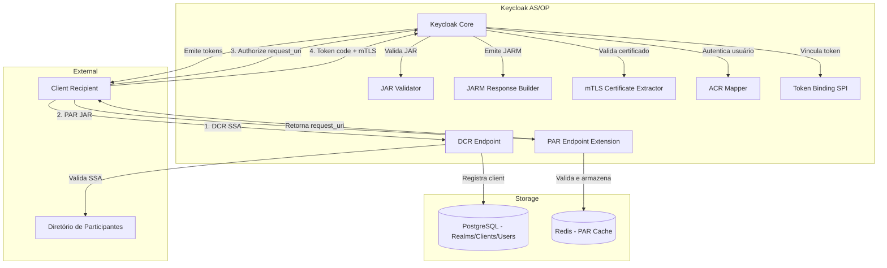

# Keycloak como Authorization Server FAPI-BR

## 1. Objetivo

Este documento detalha a configuração, extensões e operação do **Keycloak** como **Authorization Server (AS) / OpenID Provider (OP)** conforme o **[PT] Open Finance Brasil Financial-grade API Security Profile 1.0**.

O Keycloak será responsável por:
- Autenticação de usuários (clientes finais)
- Autorização de compartilhamento de dados
- Emissão de tokens OAuth2/OIDC conformes FAPI-BR
- Suporte a DCR (Dynamic Client Registration)
- Publicação de metadados via OpenID Discovery

---

## 2. Requisitos FAPI-BR

### 2.1 Mandatórios

| Requisito | Descrição | Status |
|-----------|-----------|--------|
| **PAR (RFC 9126)** | Pushed Authorization Request obrigatório | ✅ Implementar |
| **JAR (RFC 9101)** | JWT-Secured Authorization Request | ✅ Implementar |
| **JARM (openid-fapi)** | JWT-Secured Authorization Response Mode | ✅ Implementar |
| **private_key_jwt** | Autenticação de client via JWT assinado | ✅ Nativo Keycloak |
| **mTLS** | Mutual TLS com certificados ICP-Brasil | ✅ Configurar |
| **PKCE** | Proof Key for Code Exchange | ✅ Nativo Keycloak |
| **acr (LOA2)** | Level of Assurance mínimo no id_token | ✅ Implementar |
| **Claims paramétricas** | `openid_claims` com `cpf`, `cnpj`, etc. | ✅ Implementar |
| **Refresh Token** | Emissão obrigatória SEM rotação | ✅ Configurar |
| **Token Binding** | Access tokens vinculados ao certificado mTLS | ✅ Implementar |

### 2.2 Tempos de Vida de Tokens

| Token | TTL (segundos) | Configuração |
|-------|----------------|--------------|
| **Authorization Code** | 60 | Padrão Keycloak |
| **Access Token** | 300 - 900 | 600s (10min) |
| **Refresh Token** | 2592000 | 30 dias (sem rotação) |
| **ID Token** | 300 - 900 | 600s (10min) |

**Referência**: [FAPI-BR Security Profile - Seção 5.2.2](https://openfinancebrasil.atlassian.net/wiki/spaces/OF/pages/245694465)

---

## 3. Arquitetura

### 3.1 Diagrama de Componentes



### 3.2 Fluxo FAPI-BR Completo

```mermaid
sequenceDiagram
    participant C as Client (Recipient)
    participant PAR as PAR Endpoint
    participant AUTH as /authorize
    participant TOKEN as /token
    participant DB as Database
    
    Note over C,TOKEN: 1. Pushed Authorization Request (PAR)
    C->>PAR: POST /par (JAR assinado + mTLS)
    PAR->>PAR: Valida JAR (PS256, claims)
    PAR->>DB: Armazena request (TTL 90s)
    PAR-->>C: 201 Created (request_uri, expires_in)
    
    Note over C,TOKEN: 2. Authorization Request
    C->>AUTH: GET /authorize?request_uri=urn:...&client_id=...
    AUTH->>DB: Recupera request (request_uri)
    AUTH->>AUTH: Valida client_id do PAR
    AUTH->>AUTH: Redireciona para login
    Note over AUTH: Usuário autentica (LOA2/LOA3)
    AUTH->>AUTH: Usuário autoriza escopos
    AUTH->>AUTH: Emite JARM (response assinado)
    AUTH-->>C: 302 Redirect (JARM)
    
    Note over C,TOKEN: 3. Token Exchange
    C->>TOKEN: POST /token (code + mTLS + private_key_jwt)
    TOKEN->>TOKEN: Valida certificado mTLS
    TOKEN->>TOKEN: Valida private_key_jwt
    TOKEN->>TOKEN: Valida code
    TOKEN->>TOKEN: Vincula access_token ao certificado
    TOKEN-->>C: 200 OK (access_token, refresh_token, id_token)
```

---

## 4. Configuração

### 4.1 Realm Settings

```json
{
  "realm": "openfinancebrasil",
  "enabled": true,
  "sslRequired": "all",
  "registrationAllowed": false,
  "loginWithEmailAllowed": false,
  "duplicateEmailsAllowed": false,
  "resetPasswordAllowed": false,
  "editUsernameAllowed": false,
  "bruteForceProtected": true,
  "permanentLockout": false,
  "maxFailureWaitSeconds": 900,
  "minimumQuickLoginWaitSeconds": 60,
  "waitIncrementSeconds": 60,
  "quickLoginCheckMilliSeconds": 1000,
  "maxDeltaTimeSeconds": 43200,
  "failureFactor": 5,
  
  "accessTokenLifespan": 600,
  "accessTokenLifespanForImplicitFlow": 600,
  "ssoSessionIdleTimeout": 1800,
  "ssoSessionMaxLifespan": 36000,
  "offlineSessionIdleTimeout": 2592000,
  "offlineSessionMaxLifespanEnabled": false,
  "accessCodeLifespan": 60,
  "accessCodeLifespanUserAction": 300,
  "accessCodeLifespanLogin": 1800,
  
  "attributes": {
    "parRequestUriLifespan": "90",
    "cibaAuthRequestedUserHint": "login_hint",
    "oauth2DeviceCodeLifespan": "600",
    "oauth2DevicePollingInterval": "5"
  }
}
```

### 4.2 Client Template (DCR)

```json
{
  "clientId": "${SOFTWARE_ID}",
  "name": "${SOFTWARE_NAME}",
  "enabled": true,
  "protocol": "openid-connect",
  "publicClient": false,
  "bearerOnly": false,
  "standardFlowEnabled": true,
  "implicitFlowEnabled": false,
  "directAccessGrantsEnabled": false,
  "serviceAccountsEnabled": false,
  
  "redirectUris": ["${REDIRECT_URIS}"],
  "webOrigins": ["${WEB_ORIGINS}"],
  
  "attributes": {
    "pkce.code.challenge.method": "S256",
    "require.pushed.authorization.requests": "true",
    "tls.client.certificate.bound.access.tokens": "true",
    "token.endpoint.auth.method": "private_key_jwt",
    "token.endpoint.auth.signing.alg": "PS256",
    "request.object.signature.alg": "PS256",
    "request.object.encryption.alg": "RSA-OAEP",
    "request.object.encryption.enc": "A256GCM",
    "authorization.signed.response.alg": "PS256",
    "authorization.encrypted.response.alg": "RSA-OAEP",
    "authorization.encrypted.response.enc": "A256GCM",
    "id.token.signed.response.alg": "PS256",
    "user.info.response.signature.alg": "PS256",
    "access.token.signed.response.alg": "PS256"
  },
  
  "protocolMappers": [
    {
      "name": "acr-mapper",
      "protocol": "openid-connect",
      "protocolMapper": "oidc-acr-mapper",
      "config": {
        "id.token.claim": "true",
        "access.token.claim": "false",
        "userinfo.token.claim": "false",
        "included.custom.audience": ""
      }
    },
    {
      "name": "cpf-mapper",
      "protocol": "openid-connect",
      "protocolMapper": "oidc-usermodel-attribute-mapper",
      "config": {
        "user.attribute": "cpf",
        "claim.name": "cpf",
        "jsonType.label": "String",
        "id.token.claim": "true",
        "access.token.claim": "false",
        "userinfo.token.claim": "true"
      }
    }
  ]
}
```

### 4.3 mTLS Configuration

**Keycloak Standalone (standalone.xml / standalone-ha.xml)**:

```xml
<subsystem xmlns="urn:jboss:domain:undertow:14.0">
    <server name="default-server">
        <https-listener name="https" 
                        socket-binding="https" 
                        security-realm="ApplicationRealm" 
                        verify-client="REQUESTED"
                        enable-http2="true"/>
    </server>
</subsystem>

<security-realm name="ApplicationRealm">
    <server-identities>
        <ssl>
            <keystore path="keystore/server-keystore.jks" 
                      relative-to="jboss.server.config.dir" 
                      keystore-password="${KEYSTORE_PASSWORD}"
                      alias="server"/>
        </ssl>
    </server-identities>
    <authentication>
        <truststore path="keystore/truststore.jks" 
                    relative-to="jboss.server.config.dir" 
                    keystore-password="${TRUSTSTORE_PASSWORD}"/>
    </authentication>
</security-realm>
```

**Kubernetes (Ingress NGINX)**:

```yaml
apiVersion: networking.k8s.io/v1
kind: Ingress
metadata:
  name: keycloak-mtls
  annotations:
    nginx.ingress.kubernetes.io/auth-tls-verify-client: "optional"
    nginx.ingress.kubernetes.io/auth-tls-secret: "default/ca-secret"
    nginx.ingress.kubernetes.io/auth-tls-verify-depth: "3"
    nginx.ingress.kubernetes.io/auth-tls-pass-certificate-to-upstream: "true"
spec:
  tls:
  - hosts:
    - as.openfinance.example.com
    secretName: tls-secret
  rules:
  - host: as.openfinance.example.com
    http:
      paths:
      - path: /
        pathType: Prefix
        backend:
          service:
            name: keycloak
            port:
              number: 8080
```

---

## 5. Extensões Customizadas

### 5.1 PAR Endpoint

**Localização**: `apps/common/auth-broker/src/main/java/br/com/openfinance/keycloak/par`

**Funcionalidades**:
- Recebe POST `/realms/{realm}/par`
- Valida JAR (assinatura PS256, claims obrigatórias)
- Armazena request no Redis (TTL 90s)
- Retorna `request_uri` (urn:ietf:params:oauth:request_uri:{uuid})

**Endpoint**:
```java
@Path("/realms/{realm}/par")
public class PushedAuthorizationRequestEndpoint {
    
    @POST
    @Consumes(MediaType.APPLICATION_FORM_URLENCODED)
    @Produces(MediaType.APPLICATION_JSON)
    public Response pushAuthorizationRequest(
            @PathParam("realm") String realmName,
            @FormParam("request") String requestJwt) {
        
        // 1. Valida mTLS
        X509Certificate clientCert = extractClientCertificate();
        validateCertificate(clientCert);
        
        // 2. Parse e valida JAR
        SignedJWT signedJWT = SignedJWT.parse(requestJwt);
        validateJAR(signedJWT, clientCert);
        
        // 3. Armazena no Redis
        String requestUri = generateRequestUri();
        redis.setex(requestUri, 90, requestJwt);
        
        // 4. Retorna
        return Response.status(201).entity(Map.of(
            "request_uri", requestUri,
            "expires_in", 90
        )).build();
    }
}
```

### 5.2 JARM Response Builder

**Localização**: `apps/common/auth-broker/src/main/java/br/com/openfinance/keycloak/jarm`

**Funcionalidades**:
- Intercepta resposta do `/authorize`
- Cria JWT assinado (PS256) contendo `code`, `state`, `iss`
- Retorna via query parameter `response=<JWT>` ou fragment

**Implementação**:
```java
public class JarmResponseBuilder implements AuthorizationEndpointResponseHandler {
    
    @Override
    public Response handleResponse(AuthorizationEndpointContext context) {
        
        // 1. Obtém dados da autorização
        String code = context.getAuthorizationCode();
        String state = context.getState();
        String issuer = context.getRealm().getIssuerUrl();
        
        // 2. Cria JWT (JARM)
        JWSHeader header = new JWSHeader.Builder(JWSAlgorithm.PS256)
            .keyID(context.getRealm().getActiveKey("RS256").getKid())
            .build();
        
        JWTClaimsSet claims = new JWTClaimsSet.Builder()
            .issuer(issuer)
            .audience(context.getClient().getClientId())
            .expirationTime(new Date(System.currentTimeMillis() + 60000))
            .claim("code", code)
            .claim("state", state)
            .build();
        
        SignedJWT signedJWT = new SignedJWT(header, claims);
        signedJWT.sign(signer);
        
        // 3. Redireciona com JARM
        String redirectUri = context.getRedirectUri() + "?response=" + signedJWT.serialize();
        return Response.status(302).location(URI.create(redirectUri)).build();
    }
}
```

### 5.3 Token Binding (mTLS Certificate Bound Tokens)

**Localização**: `apps/common/auth-broker/src/main/java/br/com/openfinance/keycloak/mtls`

**Funcionalidades**:
- Extrai certificado mTLS da requisição
- Calcula SHA-256 do certificado DER
- Adiciona `cnf` claim no access token

**Implementação**:
```java
public class MtlsTokenBindingSpi implements TokenMapper {
    
    @Override
    public void transformAccessToken(AccessToken token, 
                                     ProtocolMapperModel mappingModel,
                                     KeycloakSession session,
                                     UserSessionModel userSession,
                                     ClientSessionContext clientSessionCtx) {
        
        X509Certificate cert = extractClientCertificate(session);
        if (cert != null) {
            String thumbprint = calculateSHA256Thumbprint(cert);
            Map<String, Object> cnf = Map.of("x5t#S256", thumbprint);
            token.setOtherClaims("cnf", cnf);
        }
    }
    
    private String calculateSHA256Thumbprint(X509Certificate cert) {
        try {
            byte[] der = cert.getEncoded();
            MessageDigest sha256 = MessageDigest.getInstance("SHA-256");
            byte[] hash = sha256.digest(der);
            return Base64.getUrlEncoder().withoutPadding().encodeToString(hash);
        } catch (Exception e) {
            throw new RuntimeException("Failed to calculate certificate thumbprint", e);
        }
    }
}
```

### 5.4 ACR (Authentication Context Class Reference)

**Configuração**:
- LOA2: autenticação com usuário/senha + OTP
- LOA3: autenticação com certificado digital + biometria

**Protocol Mapper**:
```java
public class AcrMapper extends AbstractOIDCProtocolMapper implements OIDCIDTokenMapper {
    
    @Override
    protected void setClaim(IDToken token, ProtocolMapperModel mappingModel,
                          UserSessionModel userSession,
                          KeycloakSession keycloakSession,
                          ClientSessionContext clientSessionCtx) {
        
        String authenticationMethod = userSession.getNote("auth_method");
        String acr = determineAcr(authenticationMethod);
        token.setAcr(acr);
    }
    
    private String determineAcr(String authMethod) {
        // Lógica baseada em: https://openid.net/specs/openid-connect-core-1_0.html#IDToken
        return switch (authMethod) {
            case "certificate+biometric" -> "urn:openbanking:psd2:sca"; // LOA3
            case "password+otp" -> "urn:openbanking:psd2:ca"; // LOA2
            default -> "urn:openbanking:psd2:ca"; // LOA2 default
        };
    }
}
```

---

## 6. OpenID Discovery

**Endpoint**: `GET /.well-known/openid-configuration`

**Response (parcial)**:
```json
{
  "issuer": "https://as.openfinance.example.com/realms/openfinancebrasil",
  "authorization_endpoint": "https://as.openfinance.example.com/realms/openfinancebrasil/protocol/openid-connect/auth",
  "token_endpoint": "https://as.openfinance.example.com/realms/openfinancebrasil/protocol/openid-connect/token",
  "userinfo_endpoint": "https://as.openfinance.example.com/realms/openfinancebrasil/protocol/openid-connect/userinfo",
  "jwks_uri": "https://as.openfinance.example.com/realms/openfinancebrasil/protocol/openid-connect/certs",
  "registration_endpoint": "https://as.openfinance.example.com/realms/openfinancebrasil/clients-registrations/openid-connect",
  "pushed_authorization_request_endpoint": "https://as.openfinance.example.com/realms/openfinancebrasil/par",
  
  "scopes_supported": [
    "openid", "consent", "resources", "customers", "accounts"
  ],
  "response_types_supported": ["code"],
  "response_modes_supported": ["query", "fragment", "jwt"],
  "grant_types_supported": ["authorization_code", "refresh_token"],
  
  "acr_values_supported": [
    "urn:openbanking:psd2:ca",
    "urn:openbanking:psd2:sca"
  ],
  
  "subject_types_supported": ["public", "pairwise"],
  
  "id_token_signing_alg_values_supported": ["PS256", "ES256"],
  "id_token_encryption_alg_values_supported": ["RSA-OAEP", "RSA-OAEP-256"],
  "id_token_encryption_enc_values_supported": ["A256GCM", "A128CBC-HS256"],
  
  "userinfo_signing_alg_values_supported": ["PS256", "ES256"],
  
  "request_object_signing_alg_values_supported": ["PS256", "ES256"],
  "request_object_encryption_alg_values_supported": ["RSA-OAEP", "RSA-OAEP-256"],
  "request_object_encryption_enc_values_supported": ["A256GCM", "A128CBC-HS256"],
  
  "authorization_signing_alg_values_supported": ["PS256", "ES256"],
  "authorization_encryption_alg_values_supported": ["RSA-OAEP", "RSA-OAEP-256"],
  "authorization_encryption_enc_values_supported": ["A256GCM", "A128CBC-HS256"],
  
  "token_endpoint_auth_methods_supported": ["private_key_jwt", "tls_client_auth"],
  "token_endpoint_auth_signing_alg_values_supported": ["PS256", "ES256"],
  
  "tls_client_certificate_bound_access_tokens": true,
  "require_pushed_authorization_requests": true,
  "require_signed_request_object": true,
  
  "claims_supported": [
    "sub", "iss", "auth_time", "acr", "name", "given_name", "family_name",
    "email", "email_verified", "phone_number", "phone_number_verified",
    "address", "updated_at", "cpf", "cnpj"
  ],
  
  "claim_types_supported": ["normal"],
  "claims_parameter_supported": true
}
```

---

## 7. Testes e Validação

### 7.1 Suites de Conformidade

**BR-OB FAPI-BR Certification**:
- RP (Relying Party) Test Suite
- OP (OpenID Provider) Test Suite
- DCR Test Suite

**Execução**:
```bash
# Configurar conformance suite
git clone https://gitlab.com/openid/conformance-suite.git
cd conformance-suite
docker-compose up -d

# Acessar: https://localhost:8443
# Configurar plan: BR-OB FAPI-BR OP Test
# Endpoint: https://as.openfinance.example.com/realms/openfinancebrasil
```

### 7.2 Testes Unitários

**Exemplo - PAR Validation**:
```java
@Test
void testParValidation_ValidJAR_ReturnsRequestUri() {
    // Arrange
    String validJAR = createValidJAR();
    X509Certificate validCert = loadValidCertificate();
    
    // Act
    Response response = parEndpoint.pushAuthorizationRequest("openfinancebrasil", validJAR);
    
    // Assert
    assertEquals(201, response.getStatus());
    Map<String, Object> body = (Map) response.getEntity();
    assertTrue(body.get("request_uri").toString().startsWith("urn:ietf:params:oauth:request_uri:"));
    assertEquals(90, body.get("expires_in"));
}

@Test
void testParValidation_ExpiredSSA_Returns400() {
    // Arrange
    String expiredJAR = createJARWithExpiredSSA();
    
    // Act
    Response response = parEndpoint.pushAuthorizationRequest("openfinancebrasil", expiredJAR);
    
    // Assert
    assertEquals(400, response.getStatus());
    Map<String, Object> error = (Map) response.getEntity();
    assertEquals("invalid_request", error.get("error"));
}
```

### 7.3 Testes de Integração

**Cenário - Fluxo completo FAPI-BR**:
```java
@Test
void testFullFapiBrFlow_ValidClient_ReturnsTokens() {
    // 1. DCR
    String clientId = dcrClient.register(validSSA);
    
    // 2. PAR
    String requestUri = parClient.push(clientId, createJAR());
    
    // 3. Authorize (simulado)
    String code = simulateUserAuthorization(requestUri, clientId);
    
    // 4. Token
    TokenResponse tokens = tokenClient.exchange(code, clientId, clientCert);
    
    // Asserts
    assertNotNull(tokens.getAccessToken());
    assertNotNull(tokens.getRefreshToken());
    assertNotNull(tokens.getIdToken());
    
    // Valida token binding
    JWTClaimsSet accessTokenClaims = parseJWT(tokens.getAccessToken());
    Map<String, Object> cnf = (Map) accessTokenClaims.getClaim("cnf");
    assertEquals(calculateCertThumbprint(clientCert), cnf.get("x5t#S256"));
    
    // Valida acr
    JWTClaimsSet idTokenClaims = parseJWT(tokens.getIdToken());
    assertEquals("urn:openbanking:psd2:ca", idTokenClaims.getStringClaim("acr"));
}
```

---

## 8. Métricas e Observabilidade

### 8.1 Métricas Chave

| Métrica | Descrição | Threshold |
|---------|-----------|-----------|
| `keycloak_logins_total` | Total de logins (sucesso/falha) | - |
| `keycloak_token_issued_total` | Tokens emitidos por tipo | - |
| `keycloak_par_requests_total` | Requisições PAR | - |
| `keycloak_par_validation_errors_total` | Erros de validação PAR | < 5% |
| `keycloak_dcr_registrations_total` | Registros DCR | - |
| `keycloak_response_time_seconds` | Latência por endpoint (p50, p95, p99) | p95 < 1.5s |
| `keycloak_db_connections_active` | Conexões DB ativas | < 80% pool |

### 8.2 Logs Estruturados

**Formato**:
```json
{
  "timestamp": "2025-11-08T10:30:45.123Z",
  "level": "INFO",
  "logger": "br.com.openfinance.keycloak.par.PAREndpoint",
  "message": "PAR request validated successfully",
  "requestId": "550e8400-e29b-41d4-a716-446655440000",
  "clientId": "aCnBHjZBvD6w4Hgb6BVKo",
  "softwareId": "aCnBHjZBvD6w4Hgb6BVKo",
  "realm": "openfinancebrasil",
  "mtls_subject": "CN=Client App, O=Example Org, C=BR",
  "duration_ms": 87
}
```

### 8.3 Traces (OpenTelemetry)

**Instrumentação**:
```java
@WithSpan
public Response pushAuthorizationRequest(String realmName, String requestJwt) {
    Span span = Span.current();
    span.setAttribute("realm", realmName);
    span.setAttribute("client_id", extractClientId(requestJwt));
    
    try {
        // ... lógica ...
        span.setStatus(StatusCode.OK);
        return response;
    } catch (Exception e) {
        span.recordException(e);
        span.setStatus(StatusCode.ERROR);
        throw e;
    }
}
```

---

## 9. Operação e Runbook

### 9.1 Deploy

> **Nota**: utiliza cluster Kubernetes existente.

**Helm Chart**:
```bash
helm upgrade --install keycloak bitnami/keycloak \
  --set auth.adminUser=admin \
  --set auth.adminPassword=${ADMIN_PASSWORD} \
  --set postgresql.enabled=true \
  --set postgresql.auth.password=${DB_PASSWORD} \
  --set replicaCount=3 \
  --set extraEnvVars[0].name=JAVA_OPTS \
  --set extraEnvVars[0].value="-Xms2g -Xmx2g -XX:+UseG1GC" \
  --set ingress.enabled=true \
  --set ingress.hostname=as.openfinance.example.com \
  --set ingress.tls=true \
  -f values/prod.yaml
```

### 9.2 Troubleshooting

#### Problema: PAR retorna 400 (invalid_request)

**Diagnóstico**:
```bash
# 1. Verificar logs
kubectl logs -l app=keycloak --tail=100 | grep PAR

# 2. Validar JAR manualmente
echo $REQUEST_JWT | base64 -d | jq .

# 3. Verificar Redis
kubectl exec -it redis-0 -- redis-cli
> TTL urn:ietf:params:oauth:request_uri:...
```

**Causa comum**: `iat` do SSA expirado (> 5 minutos)

#### Problema: Token endpoint retorna 401 (invalid_client)

**Diagnóstico**:
```bash
# Verificar certificado mTLS
openssl s_client -connect as.openfinance.example.com:443 \
  -cert client.crt -key client.key -CAfile ca.crt

# Validar private_key_jwt
echo $CLIENT_ASSERTION | base64 -d | jq .
```

**Causa comum**: `client_assertion` assinado com algoritmo errado (deve ser PS256)

### 9.3 Backup e Restore

**Backup PostgreSQL**:
```bash
kubectl exec -it keycloak-postgresql-0 -- \
  pg_dump -U keycloak -F c -b -v -f /tmp/keycloak-backup.dump keycloak

kubectl cp keycloak-postgresql-0:/tmp/keycloak-backup.dump ./keycloak-backup-$(date +%Y%m%d).dump
```

**Restore**:
```bash
kubectl cp ./keycloak-backup.dump keycloak-postgresql-0:/tmp/
kubectl exec -it keycloak-postgresql-0 -- \
  pg_restore -U keycloak -d keycloak -v /tmp/keycloak-backup.dump
```

---

## 10. Segurança

### 10.1 Hardening

- ✅ Desabilitar endpoints não utilizados (`/admin-cli`, `/account`)
- ✅ Configurar rate limiting no Ingress (max 100 req/min por IP para `/par`, `/token`)
- ✅ Habilitar CSRF protection
- ✅ Configurar CORS restritivo
- ✅ Rotação automática de chaves (JWK rotation a cada 90 dias)
- ✅ Audit logging de todas as operações administrativas

### 10.2 Certificados

**Truststore (ICP-Brasil)**:
```bash
# Download da cadeia ICP-Brasil
wget http://acraiz.icpbrasil.gov.br/credenciadas/RAIZ/ICP-Brasilv5.crt
wget http://acraiz.icpbrasil.gov.br/credenciadas/RAIZ/ICP-Brasilv10.crt

# Import para truststore
keytool -import -trustcacerts -alias icpbrasil-v5 \
  -file ICP-Brasilv5.crt \
  -keystore truststore.jks \
  -storepass changeit

keytool -import -trustcacerts -alias icpbrasil-v10 \
  -file ICP-Brasilv10.crt \
  -keystore truststore.jks \
  -storepass changeit
```

---

## 11. Referências

- [FAPI-BR Security Profile](https://openfinancebrasil.atlassian.net/wiki/spaces/OF/pages/245694465)
- [RFC 9126 - PAR](https://www.rfc-editor.org/rfc/rfc9126.html)
- [RFC 9101 - JAR](https://www.rfc-editor.org/rfc/rfc9101.html)
- [JARM - Financial-grade API](https://openid.net/specs/openid-financial-api-jarm.html)
- [Keycloak Documentation](https://www.keycloak.org/documentation)
- [OpenID Conformance Suite](https://openid.net/certification/testing/)

---

**Última atualização**: Novembro 2025  
**Versão do documento**: 1.0  
**Mantido por**: Equipe de Segurança e Identidade
