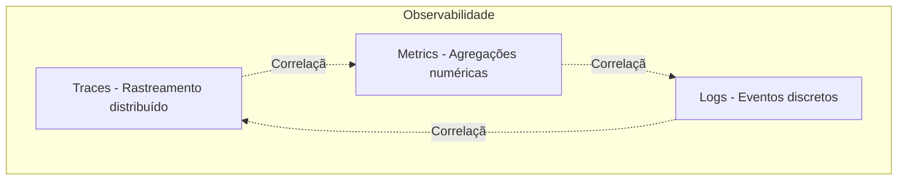
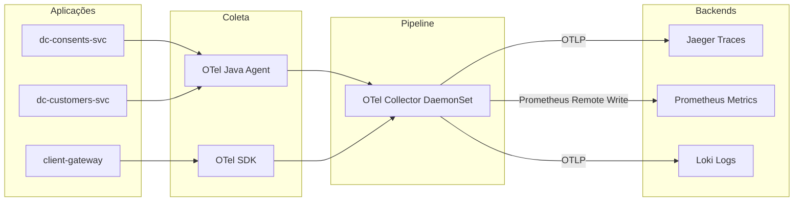

# Observabilidade - Open Finance Brasil

## 1. Objetivo

Este documento estabelece os padrões de **observabilidade** para o projeto Open Finance Brasil, abrangendo:

- **Traces**: rastreamento distribuído de requisições
- **Metrics**: métricas de aplicação e infraestrutura
- **Logs**: registros estruturados de eventos
- Correlação entre traces, métricas e logs
- Dashboards e alertas

A observabilidade é crucial para:
- Diagnosticar problemas rapidamente
- Monitorar conformidade com SLAs regulatórios
- Otimizar performance
- Detectar anomalias e fraudes
- Auditar operações

---

## 2. Princípios

### 2.1 Observabilidade por Design

- Instrumentação automática via OpenTelemetry
- Contexto de correlação em todas as camadas
- Métricas RED (Rate, Errors, Duration) por endpoint
- Logs estruturados (JSON) sem dados sensíveis

### 2.2 Três Pilares



### 2.3 Padrão de Correlação

Toda requisição possui identificadores únicos que permitem correlacionar traces, métricas e logs:

| Identificador | Origem | Propagação | Uso |
|---------------|--------|------------|-----|
| `x-fapi-interaction-id` | Client ou gerado pelo AS | Header HTTP | Correlação externa (FAPI-BR obrigatório) |
| `trace_id` | OpenTelemetry | W3C Trace Context | Correlação interna (spans) |
| `span_id` | OpenTelemetry | W3C Trace Context | Identificação de operação específica |
| `requestId` | Gerado no gateway | MDC/Thread Local | Correlação logs/métricas |

---

## 3. OpenTelemetry

### 3.1 Arquitetura



### 3.2 Configuração (Java)

**Auto-Instrumentation com OTel Java Agent**:

```bash
# Download agent
wget https://github.com/open-telemetry/opentelemetry-java-instrumentation/releases/latest/download/opentelemetry-javaagent.jar

# Execução
java -javaagent:opentelemetry-javaagent.jar \
     -Dotel.service.name=dc-consents-svc \
     -Dotel.traces.exporter=otlp \
     -Dotel.metrics.exporter=otlp \
     -Dotel.logs.exporter=otlp \
     -Dotel.exporter.otlp.endpoint=http://otel-collector:4317 \
     -Dotel.resource.attributes=environment=prod,team=openfinance \
     -jar app.jar
```

**Kubernetes (Deployment)**:

```yaml
apiVersion: apps/v1
kind: Deployment
metadata:
  name: dc-consents-svc
spec:
  template:
    metadata:
      annotations:
        instrumentation.opentelemetry.io/inject-java: "true"
    spec:
      containers:
      - name: app
        image: dc-consents-svc:latest
        env:
        - name: OTEL_SERVICE_NAME
          value: "dc-consents-svc"
        - name: OTEL_EXPORTER_OTLP_ENDPOINT
          value: "http://otel-collector:4317"
        - name: OTEL_RESOURCE_ATTRIBUTES
          value: "environment=prod,team=openfinance,version=1.2.3"
        - name: OTEL_TRACES_SAMPLER
          value: "parentbased_traceidratio"
        - name: OTEL_TRACES_SAMPLER_ARG
          value: "0.1" # Sample 10% das traces em prod
```

**OTel Operator (Auto-Instrumentation)**:

```yaml
apiVersion: opentelemetry.io/v1alpha1
kind: Instrumentation
metadata:
  name: java-instrumentation
  namespace: openfinance
spec:
  exporter:
    endpoint: http://otel-collector:4317
  propagators:
    - tracecontext
    - baggage
  sampler:
    type: parentbased_traceidratio
    argument: "0.1"
  java:
    image: ghcr.io/open-telemetry/opentelemetry-operator/autoinstrumentation-java:latest
    env:
    - name: OTEL_JAVAAGENT_EXTENSIONS
      value: "/otel-extensions/extensions.jar"
```

### 3.3 Configuração Manual (SDK)

**Spring Boot** (`application.yaml`):

```yaml
management:
  tracing:
    enabled: true
    sampling:
      probability: 0.1 # 10% em prod, 1.0 em dev
  otlp:
    tracing:
      endpoint: http://otel-collector:4318/v1/traces
    metrics:
      endpoint: http://otel-collector:4318/v1/metrics

spring:
  application:
    name: dc-consents-svc
```

**Configuração Programática**:

```java
@Configuration
public class OpenTelemetryConfig {
    
    @Bean
    public OpenTelemetry openTelemetry() {
        
        Resource resource = Resource.getDefault()
            .merge(Resource.create(Attributes.of(
                ResourceAttributes.SERVICE_NAME, "dc-consents-svc",
                ResourceAttributes.SERVICE_VERSION, "1.2.3",
                ResourceAttributes.DEPLOYMENT_ENVIRONMENT, "prod"
            )));
        
        SdkTracerProvider sdkTracerProvider = SdkTracerProvider.builder()
            .addSpanProcessor(BatchSpanProcessor.builder(
                OtlpGrpcSpanExporter.builder()
                    .setEndpoint("http://otel-collector:4317")
                    .build()
            ).build())
            .setResource(resource)
            .setSampler(Sampler.parentBased(Sampler.traceIdRatioBased(0.1)))
            .build();
        
        SdkMeterProvider sdkMeterProvider = SdkMeterProvider.builder()
            .registerMetricReader(
                PeriodicMetricReader.builder(
                    OtlpGrpcMetricExporter.builder()
                        .setEndpoint("http://otel-collector:4317")
                        .build()
                ).build()
            )
            .setResource(resource)
            .build();
        
        return OpenTelemetrySdk.builder()
            .setTracerProvider(sdkTracerProvider)
            .setMeterProvider(sdkMeterProvider)
            .setPropagators(ContextPropagators.create(
                TextMapPropagator.composite(
                    W3CTraceContextPropagator.getInstance(),
                    W3CBaggagePropagator.getInstance()
                )
            ))
            .buildAndRegisterGlobal();
    }
}
```

### 3.4 Propagação de Contexto

**Injeção do x-fapi-interaction-id**:

```java
@Component
public class FapiInteractionIdFilter extends OncePerRequestFilter {
    
    private static final String FAPI_INTERACTION_ID_HEADER = "x-fapi-interaction-id";
    
    @Override
    protected void doFilterInternal(HttpServletRequest request,
                                   HttpServletResponse response,
                                   FilterChain filterChain) throws ServletException, IOException {
        
        // 1. Extrai ou gera x-fapi-interaction-id
        String fapiInteractionId = request.getHeader(FAPI_INTERACTION_ID_HEADER);
        if (fapiInteractionId == null || fapiInteractionId.isEmpty()) {
            fapiInteractionId = UUID.randomUUID().toString();
        }
        
        // 2. Adiciona ao span atual
        Span currentSpan = Span.current();
        currentSpan.setAttribute("http.request.header.x-fapi-interaction-id", fapiInteractionId);
        
        // 3. Adiciona ao MDC (para logs)
        MDC.put("fapiInteractionId", fapiInteractionId);
        
        // 4. Echo na resposta (obrigatório FAPI-BR)
        response.setHeader(FAPI_INTERACTION_ID_HEADER, fapiInteractionId);
        
        try {
            filterChain.doFilter(request, response);
        } finally {
            MDC.remove("fapiInteractionId");
        }
    }
}
```

**Propagação para chamadas downstream**:

```java
@Component
public class OtelHttpClientInterceptor implements ClientHttpRequestInterceptor {
    
    @Override
    public ClientHttpResponse intercept(HttpRequest request, byte[] body, 
                                        ClientHttpRequestExecution execution) throws IOException {
        
        // 1. Injeta trace context (W3C)
        Context context = Context.current();
        GlobalOpenTelemetry.getPropagators().getTextMapPropagator()
            .inject(context, request.getHeaders(), HttpHeaders::set);
        
        // 2. Injeta x-fapi-interaction-id
        String fapiInteractionId = MDC.get("fapiInteractionId");
        if (fapiInteractionId != null) {
            request.getHeaders().set("x-fapi-interaction-id", fapiInteractionId);
        }
        
        return execution.execute(request, body);
    }
}
```

---

## 4. Traces

### 4.1 Estrutura de Span

```java
@Service
public class ConsentService {
    
    private final Tracer tracer;
    
    @WithSpan("ConsentService.createConsent")
    public ConsentResponse createConsent(ConsentRequest request) {
        
        Span span = Span.current();
        
        // Atributos obrigatórios
        span.setAttribute("consent.type", request.getType());
        span.setAttribute("consent.permissions", String.join(",", request.getPermissions()));
        span.setAttribute("client.id", request.getClientId());
        span.setAttribute("software.id", request.getSoftwareId());
        
        try {
            // Lógica de negócio
            ConsentResponse response = processConsent(request);
            
            // Atributos de sucesso
            span.setAttribute("consent.id", response.getConsentId());
            span.setAttribute("consent.status", response.getStatus());
            span.setStatus(StatusCode.OK);
            
            return response;
            
        } catch (ValidationException e) {
            // Erro de validação
            span.recordException(e);
            span.setAttribute("error.type", "validation");
            span.setStatus(StatusCode.ERROR, "Validation failed");
            throw e;
            
        } catch (Exception e) {
            // Erro inesperado
            span.recordException(e);
            span.setStatus(StatusCode.ERROR, e.getMessage());
            throw e;
        }
    }
    
    private ConsentResponse processConsent(ConsentRequest request) {
        // Cria child span manualmente
        Span childSpan = tracer.spanBuilder("validateBusinessRules")
            .setParent(Context.current())
            .startSpan();
        
        try (Scope scope = childSpan.makeCurrent()) {
            // Validações de negócio
            validatePermissions(request.getPermissions());
            validateExpirationDate(request.getExpirationDateTime());
            
            childSpan.setStatus(StatusCode.OK);
            return new ConsentResponse(...);
            
        } catch (Exception e) {
            childSpan.recordException(e);
            childSpan.setStatus(StatusCode.ERROR);
            throw e;
        } finally {
            childSpan.end();
        }
    }
}
```

### 4.2 Convenções de Nomenclatura

| Tipo de Operação | Padrão de Nome | Exemplo |
|------------------|----------------|---------|
| HTTP Server | `HTTP {METHOD} {route}` | `HTTP POST /consents` |
| HTTP Client | `HTTP {METHOD} {host}` | `HTTP GET api.banco.com.br` |
| Database Query | `{operation} {table}` | `SELECT consents` |
| Message Queue | `{operation} {queue}` | `PUBLISH consent.created` |
| Service Method | `{Class}.{method}` | `ConsentService.createConsent` |

### 4.3 Atributos Semânticos Padrão

**HTTP**:
```java
span.setAttribute(SemanticAttributes.HTTP_METHOD, "POST");
span.setAttribute(SemanticAttributes.HTTP_URL, "https://api.banco.com.br/consents");
span.setAttribute(SemanticAttributes.HTTP_STATUS_CODE, 201);
span.setAttribute(SemanticAttributes.HTTP_REQUEST_CONTENT_LENGTH, 512);
span.setAttribute(SemanticAttributes.HTTP_RESPONSE_CONTENT_LENGTH, 256);
```

**Database**:
```java
span.setAttribute(SemanticAttributes.DB_SYSTEM, "postgresql");
span.setAttribute(SemanticAttributes.DB_NAME, "openfinance");
span.setAttribute(SemanticAttributes.DB_STATEMENT, "SELECT * FROM consents WHERE id = ?");
span.setAttribute(SemanticAttributes.DB_OPERATION, "SELECT");
```

**Messaging**:
```java
span.setAttribute(SemanticAttributes.MESSAGING_SYSTEM, "AmazonSQS");
span.setAttribute(SemanticAttributes.MESSAGING_DESTINATION, "consent-created-queue");
span.setAttribute(SemanticAttributes.MESSAGING_OPERATION, "publish");
span.setAttribute(SemanticAttributes.MESSAGING_MESSAGE_ID, "msg-123");
```

---

## 5. Métricas

### 5.1 Métricas RED (Rate, Errors, Duration)

**Implementação (Micrometer + OTel)**:

```java
@Configuration
public class MetricsConfig {
    
    @Bean
    public MeterFilter meterFilter() {
        return MeterFilter.commonTags(
            Tags.of(
                "application", "dc-consents-svc",
                "environment", "prod"
            )
        );
    }
}

@RestController
@Timed // Auto-instrumentação de duração
public class ConsentsController {
    
    private final Counter consentCreatedCounter;
    private final Counter consentErrorCounter;
    private final Timer consentCreationTimer;
    private final DistributionSummary consentSizeSummary;
    
    public ConsentsController(MeterRegistry registry) {
        // Rate
        this.consentCreatedCounter = Counter.builder("consents.created")
            .description("Total de consentimentos criados")
            .tag("endpoint", "/consents")
            .register(registry);
        
        // Errors
        this.consentErrorCounter = Counter.builder("consents.errors")
            .description("Total de erros na criação de consentimentos")
            .tag("endpoint", "/consents")
            .register(registry);
        
        // Duration
        this.consentCreationTimer = Timer.builder("consents.creation.duration")
            .description("Tempo de criação de consentimento")
            .publishPercentiles(0.5, 0.95, 0.99)
            .publishPercentileHistogram()
            .register(registry);
        
        // Tamanho
        this.consentSizeSummary = DistributionSummary.builder("consents.request.size")
            .description("Tamanho do payload de requisição")
            .baseUnit("bytes")
            .register(registry);
    }
    
    @PostMapping("/consents")
    public ResponseEntity<ConsentResponse> createConsent(@RequestBody ConsentRequest request) {
        
        return consentCreationTimer.record(() -> {
            try {
                consentSizeSummary.record(calculateSize(request));
                ConsentResponse response = consentService.createConsent(request);
                consentCreatedCounter.increment();
                return ResponseEntity.status(201).body(response);
                
            } catch (Exception e) {
                consentErrorCounter.increment(Tags.of("error.type", e.getClass().getSimpleName()));
                throw e;
            }
        });
    }
}
```

### 5.2 Métricas de Negócio

```java
@Component
public class BusinessMetrics {
    
    private final Gauge activeConsentsGauge;
    private final Counter consentRevokedCounter;
    private final Counter consentExpiredCounter;
    
    public BusinessMetrics(MeterRegistry registry, ConsentRepository repository) {
        
        // Active consents (gauge atualizado dinamicamente)
        this.activeConsentsGauge = Gauge.builder("consents.active", repository, 
                repo -> repo.countByStatus("AUTHORISED"))
            .description("Número de consentimentos ativos")
            .register(registry);
        
        // Revogações
        this.consentRevokedCounter = Counter.builder("consents.revoked")
            .description("Consentimentos revogados")
            .tag("revocation.reason", "user_request")
            .register(registry);
        
        // Expirações
        this.consentExpiredCounter = Counter.builder("consents.expired")
            .description("Consentimentos expirados automaticamente")
            .register(registry);
    }
    
    public void recordRevocation(String reason) {
        consentRevokedCounter.increment(Tags.of("revocation.reason", reason));
    }
    
    public void recordExpiration() {
        consentExpiredCounter.increment();
    }
}
```

### 5.3 Métricas Regulatórias

**Disponibilidade** (conforme API Comum):

```java
@Component
public class AvailabilityMetrics {
    
    private final Counter healthCheckCounter;
    private final Timer healthCheckDuration;
    
    public AvailabilityMetrics(MeterRegistry registry) {
        this.healthCheckCounter = Counter.builder("discovery.status.checks")
            .description("Health checks executados")
            .register(registry);
        
        this.healthCheckDuration = Timer.builder("discovery.status.duration")
            .description("Duração do health check")
            .publishPercentiles(0.95)
            .register(registry);
    }
    
    public void recordHealthCheck(String status) {
        healthCheckCounter.increment(Tags.of("status", status));
    }
}
```

**Limites Operacionais**:

```java
@Component
public class QuotaMetrics {
    
    private final Counter quotaExceededCounter;
    private final Gauge quotaUsageGauge;
    
    public QuotaMetrics(MeterRegistry registry) {
        this.quotaExceededCounter = Counter.builder("quota.exceeded")
            .description("Requisições que excederam quota")
            .register(registry);
    }
    
    public void recordQuotaExceeded(String clientId, String endpoint) {
        quotaExceededCounter.increment(Tags.of(
            "client.id", clientId,
            "endpoint", endpoint
        ));
    }
}
```

### 5.4 Exportação (Prometheus)

**Endpoint Metrics**:
```
GET /actuator/prometheus
```

**Exemplo de Output**:
```prometheus
# HELP consents_created_total Total de consentimentos criados
# TYPE consents_created_total counter
consents_created_total{application="dc-consents-svc",environment="prod",endpoint="/consents"} 12345.0

# HELP consents_creation_duration_seconds Tempo de criação de consentimento
# TYPE consents_creation_duration_seconds summary
consents_creation_duration_seconds{application="dc-consents-svc",quantile="0.5"} 0.123
consents_creation_duration_seconds{application="dc-consents-svc",quantile="0.95"} 0.456
consents_creation_duration_seconds{application="dc-consents-svc",quantile="0.99"} 0.789
consents_creation_duration_seconds_count 12345
consents_creation_duration_seconds_sum 1523.45

# HELP consents_active Número de consentimentos ativos
# TYPE consents_active gauge
consents_active{application="dc-consents-svc"} 8976.0
```

---

## 6. Logs

### 6.1 Formato Estruturado

**Logback Configuration** (`logback-spring.xml`):

```xml
<configuration>
    <appender name="JSON" class="ch.qos.logback.core.ConsoleAppender">
        <encoder class="net.logstash.logback.encoder.LogstashEncoder">
            <includeMdcKeyName>trace_id</includeMdcKeyName>
            <includeMdcKeyName>span_id</includeMdcKeyName>
            <includeMdcKeyName>fapiInteractionId</includeMdcKeyName>
            <includeMdcKeyName>requestId</includeMdcKeyName>
            <includeMdcKeyName>clientId</includeMdcKeyName>
            <includeMdcKeyName>consentId</includeMdcKeyName>
            
            <customFields>{"application":"dc-consents-svc","environment":"prod"}</customFields>
            
            <fieldNames>
                <timestamp>timestamp</timestamp>
                <message>message</message>
                <logger>logger</logger>
                <level>level</level>
                <thread>thread</thread>
                <stackTrace>stack_trace</stackTrace>
            </fieldNames>
        </encoder>
    </appender>
    
    <root level="INFO">
        <appender-ref ref="JSON"/>
    </root>
    
    <!-- Níveis específicos -->
    <logger name="br.com.openfinance" level="DEBUG"/>
    <logger name="org.springframework.web" level="INFO"/>
    <logger name="org.hibernate.SQL" level="DEBUG"/>
</configuration>
```

**Exemplo de Log**:

```json
{
  "timestamp": "2025-11-08T15:45:23.456Z",
  "level": "INFO",
  "logger": "br.com.openfinance.consents.ConsentService",
  "thread": "http-nio-8080-exec-5",
  "message": "Consent created successfully",
  "application": "dc-consents-svc",
  "environment": "prod",
  "trace_id": "4bf92f3577b34da6a3ce929d0e0e4736",
  "span_id": "00f067aa0ba902b7",
  "fapiInteractionId": "c770aef3-6784-41f7-8e0e-fc5c2c5c7819",
  "requestId": "req-550e8400-e29b-41d4-a716-446655440000",
  "clientId": "aCnBHjZBvD6w4Hgb6BVKo",
  "softwareId": "aCnBHjZBvD6w4Hgb6BVKo",
  "consentId": "urn:bancoex:C01:consent-123456",
  "duration_ms": 234,
  "status": "AUTHORISED"
}
```

### 6.2 Níveis de Log

| Nível | Uso | Exemplo |
|-------|-----|---------|
| **ERROR** | Erros que impedem operação | Falha ao conectar ao banco de dados |
| **WARN** | Situações anormais não-críticas | Quota próxima do limite, retry bem-sucedido |
| **INFO** | Eventos de negócio importantes | Consent criado, token emitido |
| **DEBUG** | Informações detalhadas para troubleshooting | Parâmetros de requisição, queries SQL |
| **TRACE** | Informações extremamente detalhadas | Payloads completos (apenas dev) |

### 6.3 Mascaramento de Dados Sensíveis

```java
@Component
public class SensitiveDataMasker {
    
    private static final Pattern CPF_PATTERN = Pattern.compile("(\\d{3})[\\d]{6}(\\d{2})");
    private static final Pattern ACCOUNT_PATTERN = Pattern.compile("(\\d{4})[\\d]+(\\d{2})");
    
    public String maskCpf(String cpf) {
        if (cpf == null) return null;
        return CPF_PATTERN.matcher(cpf).replaceAll("$1******$2");
    }
    
    public String maskAccount(String account) {
        if (account == null) return null;
        return ACCOUNT_PATTERN.matcher(account).replaceAll("$1****$2");
    }
    
    public String maskJson(String json) {
        // Remove campos sensíveis de JSON
        return json
            .replaceAll("\"password\"\\s*:\\s*\"[^\"]+\"", "\"password\":\"***\"")
            .replaceAll("\"token\"\\s*:\\s*\"[^\"]+\"", "\"token\":\"***\"")
            .replaceAll("\"cpf\"\\s*:\\s*\"([\\d]{3})[\\d]{6}([\\d]{2})\"", "\"cpf\":\"$1******$2\"");
    }
}

// Uso
log.info("User authenticated: cpf={}", masker.maskCpf(user.getCpf()));
```

---

## 7. Dashboards

### 7.1 Dashboard Principal (Grafana)

**Painel 1: SLOs Regulatórios**

```prometheus
# p95 por classe de endpoint
histogram_quantile(0.95, 
  sum(rate(http_server_requests_seconds_bucket{endpoint=~"/consents.*"}[5m])) by (le, endpoint)
)

# Disponibilidade (24h)
(
  sum(rate(discovery_status_checks_total{status="OK"}[24h])) /
  sum(rate(discovery_status_checks_total[24h]))
) * 100

# Taxa de erro
sum(rate(http_server_requests_total{status=~"5.."}[5m])) /
sum(rate(http_server_requests_total[5m]))
```

**Painel 2: RED Metrics**

```prometheus
# Rate (RPS)
sum(rate(http_server_requests_total[5m])) by (uri)

# Errors
sum(rate(http_server_requests_total{status=~"[45].."}[5m])) by (status, uri)

# Duration (p50, p95, p99)
histogram_quantile(0.50, sum(rate(http_server_requests_seconds_bucket[5m])) by (le, uri))
histogram_quantile(0.95, sum(rate(http_server_requests_seconds_bucket[5m])) by (le, uri))
histogram_quantile(0.99, sum(rate(http_server_requests_seconds_bucket[5m])) by (le, uri))
```

**Painel 3: Métricas de Negócio**

```prometheus
# Consentimentos ativos
consents_active

# Taxa de criação de consents
rate(consents_created_total[5m])

# Taxa de revogação
rate(consents_revoked_total[5m])
```

### 7.2 Dashboard de Infraestrutura

```prometheus
# CPU
rate(container_cpu_usage_seconds_total{pod=~"dc-consents-svc-.*"}[5m])

# Memory
container_memory_usage_bytes{pod=~"dc-consents-svc-.*"}

# Network I/O
rate(container_network_receive_bytes_total{pod=~"dc-consents-svc-.*"}[5m])
rate(container_network_transmit_bytes_total{pod=~"dc-consents-svc-.*"}[5m])
```

---

## 8. Alertas

### 8.1 Alertas Regulatórios

**Prometheus Rules** (`alerts.yaml`):

```yaml
groups:
- name: regulatory_slos
  interval: 30s
  rules:
  
  # p95 acima do limite (alta frequência)
  - alert: HighFrequencyP95Breach
    expr: |
      histogram_quantile(0.95, 
        sum(rate(http_server_requests_seconds_bucket{
          endpoint=~"/resources.*|/accounts.*"
        }[5m])) by (le, endpoint)
      ) > 1.5
    for: 5m
    labels:
      severity: critical
      slo: p95
    annotations:
      summary: "p95 acima de 1.5s em endpoint de alta frequência"
      description: "{{ $labels.endpoint }} com p95={{ $value }}s"
  
  # Disponibilidade abaixo de 95% (24h)
  - alert: DailyAvailabilityBreach
    expr: |
      (
        sum(rate(discovery_status_checks_total{status="OK"}[24h])) /
        sum(rate(discovery_status_checks_total[24h]))
      ) < 0.95
    for: 1m
    labels:
      severity: critical
      slo: availability
    annotations:
      summary: "Disponibilidade abaixo de 95% nas últimas 24h"
      description: "Disponibilidade={{ $value | humanizePercentage }}"
  
  # Taxa de erro alta
  - alert: HighErrorRate
    expr: |
      (
        sum(rate(http_server_requests_total{status=~"5.."}[5m])) /
        sum(rate(http_server_requests_total[5m]))
      ) > 0.05
    for: 2m
    labels:
      severity: warning
    annotations:
      summary: "Taxa de erro 5xx acima de 5%"
      description: "Error rate={{ $value | humanizePercentage }}"
```

### 8.2 Alertas de Infraestrutura

```yaml
groups:
- name: infrastructure
  interval: 30s
  rules:
  
  # CPU alta
  - alert: HighCpuUsage
    expr: |
      rate(container_cpu_usage_seconds_total{pod=~"dc-.*"}[5m]) > 0.8
    for: 5m
    labels:
      severity: warning
    annotations:
      summary: "CPU usage acima de 80%"
      description: "Pod {{ $labels.pod }} com CPU={{ $value | humanizePercentage }}"
  
  # Memória alta
  - alert: HighMemoryUsage
    expr: |
      container_memory_usage_bytes{pod=~"dc-.*"} / 
      container_spec_memory_limit_bytes{pod=~"dc-.*"} > 0.85
    for: 5m
    labels:
      severity: warning
    annotations:
      summary: "Memory usage acima de 85%"
  
  # Pod não saudável
  - alert: PodNotReady
    expr: |
      kube_pod_status_phase{phase!="Running"} == 1
    for: 5m
    labels:
      severity: critical
```

---

## 9. Troubleshooting com Observabilidade

### 9.1 Cenário: Alta Latência

**1. Identificar endpoints afetados (Prometheus)**:
```prometheus
topk(5, 
  histogram_quantile(0.95, 
    sum(rate(http_server_requests_seconds_bucket[5m])) by (le, uri)
  )
)
```

**2. Analisar traces (Jaeger)**:
- Buscar por `http.url=/consents` com `duration > 1s`
- Identificar span com maior duração
- Verificar child spans (DB query, HTTP calls)

**3. Correlacionar com logs (Loki)**:
```logql
{application="dc-consents-svc"} 
  | json 
  | trace_id="4bf92f3577b34da6a3ce929d0e0e4736"
  | line_format "{{.timestamp}} {{.level}} {{.message}}"
```

### 9.2 Cenário: Erro 500

**1. Métricas de erro**:
```prometheus
sum(rate(http_server_requests_total{status="500"}[5m])) by (uri)
```

**2. Logs de exceções**:
```logql
{application="dc-consents-svc", level="ERROR"}
  | json
  | stack_trace != ""
```

**3. Traces com erros**:
- Filtrar por `error=true` em Jaeger
- Analisar `span.events` (exceptions)

---

## 10. Referências

- [OpenTelemetry Documentation](https://opentelemetry.io/docs/)
- [Prometheus Best Practices](https://prometheus.io/docs/practices/)
- [Grafana Dashboards](https://grafana.com/grafana/dashboards/)
- [Micrometer Documentation](https://micrometer.io/docs)
- [FAPI-BR - Requisitos Não-Funcionais](https://openfinancebrasil.atlassian.net/wiki/spaces/OF/pages/17891396)

---

**Última atualização**: Novembro 2025  
**Versão do documento**: 1.0  
**Mantido por**: Equipe de Platform Engineering
