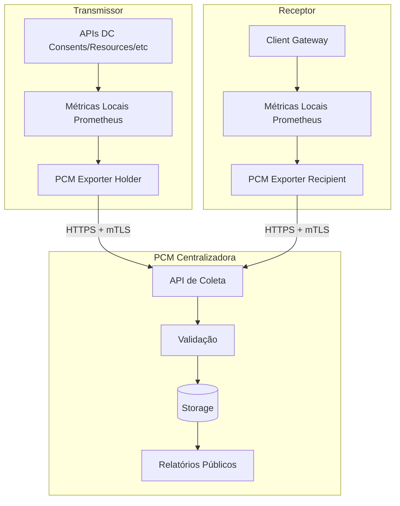
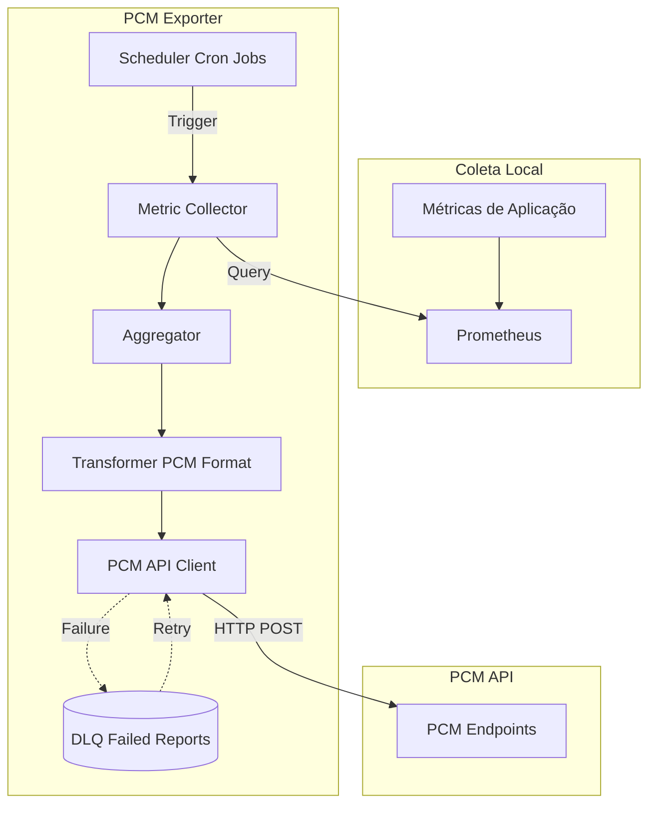

# Plataforma de Coleta de Métricas (PCM)

## 1. Objetivo

Este documento detalha a integração com a **Plataforma de Coleta de Métricas (PCM)** do Open Finance Brasil, incluindo:

- Conceitos e objetivos da PCM
- Métricas obrigatórias a serem reportadas
- Formatos e contratos de envio
- Implementação do exportador PCM
- Frequência e janelas de coleta
- Troubleshooting e validação

A PCM é um componente regulatório obrigatório que visa **promover um ambiente equitativo e não discriminatório** através da coleta centralizada de métricas de performance, disponibilidade e volumes de todas as APIs Open Finance.

**Referência oficial**: [Plataforma de Coleta de Métricas](https://openfinancebrasil.atlassian.net/wiki/spaces/OF/pages/17378055)

---

## 2. Visão Geral da PCM

### 2.1 Propósito

A PCM centraliza a coleta de métricas para:

- **Transparência**: visibilidade pública da qualidade dos serviços
- **Compliance**: monitoramento de conformidade com SLAs regulatórios
- **Equidade**: detecção de tratamento discriminatório entre participantes
- **Evolução**: insights para melhoria contínua do ecossistema

### 2.2 Responsabilidades

| Ator | Responsabilidade |
|------|------------------|
| **Transmissor (Holder)** | Reportar métricas de suas APIs expostas |
| **Receptor (Recipient)** | Reportar métricas de suas chamadas realizadas |
| **PCM** | Coletar, validar, agregar e publicar métricas |
| **Regulador** | Monitorar compliance e aplicar sanções |

### 2.3 Arquitetura



---

## 3. Métricas Obrigatórias

### 3.1 Categorias

| Categoria | Descrição | Aplicável a |
|-----------|-----------|-------------|
| **Disponibilidade** | Status das APIs (uptime/downtime) | Transmissor |
| **Performance** | Latência (p50, p95, p99) por endpoint | Transmissor |
| **Erros** | Taxa de erro por código HTTP | Transmissor e Receptor |
| **Volumes** | Quantidade de requisições por endpoint | Transmissor e Receptor |
| **Rejections** | Requisições rejeitadas (429, 423, 529) | Transmissor |

### 3.2 Estrutura de Dados

#### 3.2.1 Disponibilidade

```json
{
  "reportPeriod": {
    "startDateTime": "2025-11-08T00:00:00Z",
    "endDateTime": "2025-11-08T23:59:59Z"
  },
  "availability": {
    "endpoint": "/discovery/v2/status",
    "uptime": {
      "generalUptimeRate": "99.87",
      "endpoints": [
        {
          "url": "/consents/v2/consents",
          "uptimeRate": "99.95"
        },
        {
          "url": "/resources/v2/resources",
          "uptimeRate": "99.80"
        }
      ]
    },
    "downtime": [
      {
        "startDateTime": "2025-11-08T14:23:00Z",
        "endDateTime": "2025-11-08T14:28:00Z",
        "duration": 300,
        "type": "PARTIAL_FAILURE",
        "affectedEndpoints": [
          "/resources/v2/resources"
        ],
        "explanation": "Database connection pool exhaustion"
      }
    ]
  }
}
```

**Cálculo de Uptime**:
```
uptimeRate = (totalSeconds - downtimeSeconds) / totalSeconds * 100
```

#### 3.2.2 Performance (Latência)

```json
{
  "reportPeriod": {
    "startDateTime": "2025-11-08T00:00:00Z",
    "endDateTime": "2025-11-08T00:59:59Z"
  },
  "performance": {
    "endpoints": [
      {
        "url": "/consents/v2/consents",
        "method": "POST",
        "unauthenticatedRequests": 0,
        "authenticatedRequests": 1234,
        "averageResponseTime": 245,
        "percentiles": {
          "p50": 180,
          "p95": 456,
          "p99": 789
        }
      },
      {
        "url": "/resources/v2/resources",
        "method": "GET",
        "unauthenticatedRequests": 0,
        "authenticatedRequests": 8765,
        "averageResponseTime": 123,
        "percentiles": {
          "p50": 89,
          "p95": 234,
          "p99": 567
        }
      }
    ]
  }
}
```

**Unidades**: milissegundos (ms)

#### 3.2.3 Erros

```json
{
  "reportPeriod": {
    "startDateTime": "2025-11-08T00:00:00Z",
    "endDateTime": "2025-11-08T00:59:59Z"
  },
  "errors": {
    "endpoints": [
      {
        "url": "/consents/v2/consents",
        "method": "POST",
        "totalRequests": 1250,
        "errorsByStatusCode": [
          {
            "statusCode": "400",
            "count": 12,
            "percentage": "0.96"
          },
          {
            "statusCode": "401",
            "count": 3,
            "percentage": "0.24"
          },
          {
            "statusCode": "500",
            "count": 1,
            "percentage": "0.08"
          }
        ]
      }
    ]
  }
}
```

#### 3.2.4 Volumes

```json
{
  "reportPeriod": {
    "startDateTime": "2025-11-08T00:00:00Z",
    "endDateTime": "2025-11-08T00:59:59Z"
  },
  "volumes": {
    "endpoints": [
      {
        "url": "/consents/v2/consents",
        "method": "POST",
        "authenticatedRequests": 1234,
        "unauthenticatedRequests": 0
      },
      {
        "url": "/resources/v2/resources",
        "method": "GET",
        "authenticatedRequests": 8765,
        "unauthenticatedRequests": 0
      }
    ],
    "totalRequests": 9999,
    "uniqueClients": 45
  }
}
```

#### 3.2.5 Rejections (Rate Limits)

```json
{
  "reportPeriod": {
    "startDateTime": "2025-11-08T00:00:00Z",
    "endDateTime": "2025-11-08T00:59:59Z"
  },
  "rejections": {
    "endpoints": [
      {
        "url": "/accounts/v2/accounts",
        "rejectionsByStatusCode": [
          {
            "statusCode": "429",
            "reason": "TPM_LIMIT_EXCEEDED",
            "count": 156
          },
          {
            "statusCode": "423",
            "reason": "MONTHLY_QUOTA_EXCEEDED",
            "count": 23
          },
          {
            "statusCode": "529",
            "reason": "TPS_LIMIT_EXCEEDED",
            "count": 7
          }
        ]
      }
    ]
  }
}
```

---

## 4. Janelas de Coleta

| Métrica | Granularidade | Janela de Envio | Exemplo |
|---------|---------------|-----------------|---------|
| **Disponibilidade** | Diária | D+1 até 10:00 | Dados de 08/11 enviados até 09/11 10:00 |
| **Performance** | Horária | A cada hora + 5min | Dados 14:00-14:59 enviados até 15:05 |
| **Erros** | Horária | A cada hora + 5min | Dados 14:00-14:59 enviados até 15:05 |
| **Volumes** | Horária | A cada hora + 5min | Dados 14:00-14:59 enviados até 15:05 |
| **Rejections** | Horária | A cada hora + 5min | Dados 14:00-14:59 enviados até 15:05 |

**Observação**: horários em UTC-3 (Brasília)

---

## 5. API de Coleta

### 5.1 Autenticação

**mTLS + OAuth2 Client Credentials**:

```http
POST /oauth/token HTTP/1.1
Host: pcm.openfinancebrasil.org.br
Content-Type: application/x-www-form-urlencoded
SSL-Client-Cert: <BASE64_ENCODED_CERT>

grant_type=client_credentials&
client_id=<ORGANIZATION_ID>&
client_assertion_type=urn:ietf:params:oauth:client-assertion-type:jwt-bearer&
client_assertion=<SIGNED_JWT>
```

**Response**:
```json
{
  "access_token": "eyJhbGciOiJQUzI1NiIsInR5cCI6IkpXVCJ9...",
  "token_type": "Bearer",
  "expires_in": 3600
}
```

### 5.2 Endpoints de Envio

#### POST /metrics/availability

```http
POST /metrics/availability HTTP/1.1
Host: pcm.openfinancebrasil.org.br
Authorization: Bearer <ACCESS_TOKEN>
Content-Type: application/json
SSL-Client-Cert: <BASE64_ENCODED_CERT>

{
  "reportPeriod": { ... },
  "availability": { ... }
}
```

**Response (202 Accepted)**:
```json
{
  "reportId": "550e8400-e29b-41d4-a716-446655440000",
  "status": "ACCEPTED",
  "receivedAt": "2025-11-09T09:45:12Z"
}
```

#### POST /metrics/performance

```http
POST /metrics/performance HTTP/1.1
Host: pcm.openfinancebrasil.org.br
Authorization: Bearer <ACCESS_TOKEN>
Content-Type: application/json

{
  "reportPeriod": { ... },
  "performance": { ... }
}
```

#### POST /metrics/errors

#### POST /metrics/volumes

#### POST /metrics/rejections

---

## 6. Implementação do PCM Exporter

### 6.1 Arquitetura do Componente



### 6.2 Implementação (Spring Boot)

**Configuração**:

```yaml
pcm:
  enabled: true
  api:
    base-url: https://pcm.openfinancebrasil.org.br
    oauth-token-url: https://pcm.openfinancebrasil.org.br/oauth/token
  organization-id: f8e7d6c5-4b3a-2c1d-9e8f-000000000000
  client-id: ${PCM_CLIENT_ID}
  mtls:
    keystore: ${MTLS_KEYSTORE_PATH}
    keystore-password: ${MTLS_KEYSTORE_PASSWORD}
    truststore: ${MTLS_TRUSTSTORE_PATH}
    truststore-password: ${MTLS_TRUSTSTORE_PASSWORD}
  schedules:
    performance: "0 5 * * * *"  # A cada hora, aos 5 minutos
    errors: "0 5 * * * *"
    volumes: "0 5 * * * *"
    rejections: "0 5 * * * *"
    availability: "0 0 10 * * *"  # Diariamente às 10:00
  retry:
    max-attempts: 5
    backoff-ms: 60000
  dlq:
    enabled: true
    sqs-queue-url: ${DLQ_SQS_URL}
```

**Metric Collector**:

```java
@Service
public class PrometheusMetricCollector {
    
    private final PrometheusApi prometheusApi;
    
    public PerformanceMetrics collectPerformanceMetrics(Instant start, Instant end) {
        
        // Query p50
        String p50Query = String.format(
            "histogram_quantile(0.50, sum(rate(http_server_requests_seconds_bucket[1h])) by (le, uri, method))"
        );
        QueryResult p50Result = prometheusApi.query(p50Query, end);
        
        // Query p95
        String p95Query = String.format(
            "histogram_quantile(0.95, sum(rate(http_server_requests_seconds_bucket[1h])) by (le, uri, method))"
        );
        QueryResult p95Result = prometheusApi.query(p95Query, end);
        
        // Query p99
        String p99Query = String.format(
            "histogram_quantile(0.99, sum(rate(http_server_requests_seconds_bucket[1h])) by (le, uri, method))"
        );
        QueryResult p99Result = prometheusApi.query(p99Query, end);
        
        // Query average
        String avgQuery = String.format(
            "avg(rate(http_server_requests_seconds_sum[1h]) / rate(http_server_requests_seconds_count[1h])) by (uri, method)"
        );
        QueryResult avgResult = prometheusApi.query(avgQuery, end);
        
        // Query count (authenticated vs unauthenticated)
        String countQuery = String.format(
            "sum(increase(http_server_requests_total[1h])) by (uri, method, authenticated)"
        );
        QueryResult countResult = prometheusApi.queryRange(countQuery, start, end, "1h");
        
        return buildPerformanceMetrics(p50Result, p95Result, p99Result, avgResult, countResult);
    }
    
    public ErrorMetrics collectErrorMetrics(Instant start, Instant end) {
        
        // Total de requisições
        String totalQuery = "sum(increase(http_server_requests_total[1h])) by (uri, method)";
        QueryResult totalResult = prometheusApi.queryRange(totalQuery, start, end, "1h");
        
        // Erros por status code
        String errorsQuery = 
            "sum(increase(http_server_requests_total{status=~\"[45]..\" }[1h])) by (uri, method, status)";
        QueryResult errorsResult = prometheusApi.queryRange(errorsQuery, start, end, "1h");
        
        return buildErrorMetrics(totalResult, errorsResult);
    }
    
    public VolumeMetrics collectVolumeMetrics(Instant start, Instant end) {
        
        // Total de requisições
        String volumeQuery = 
            "sum(increase(http_server_requests_total[1h])) by (uri, method, authenticated)";
        QueryResult volumeResult = prometheusApi.queryRange(volumeQuery, start, end, "1h");
        
        // Clientes únicos
        String uniqueClientsQuery = 
            "count(count(http_server_requests_total) by (client_id))";
        QueryResult uniqueClientsResult = prometheusApi.query(uniqueClientsQuery, end);
        
        return buildVolumeMetrics(volumeResult, uniqueClientsResult);
    }
}
```

**Transformer (Prometheus → PCM Format)**:

```java
@Service
public class PcmMetricsTransformer {
    
    public PcmPerformanceReport transformPerformance(
            PerformanceMetrics metrics, 
            Instant start, 
            Instant end) {
        
        List<EndpointPerformance> endpoints = new ArrayList<>();
        
        for (EndpointMetric metric : metrics.getEndpoints()) {
            endpoints.add(EndpointPerformance.builder()
                .url(metric.getUri())
                .method(metric.getMethod())
                .authenticatedRequests(metric.getAuthenticatedCount())
                .unauthenticatedRequests(metric.getUnauthenticatedCount())
                .averageResponseTime(convertToMillis(metric.getAverage()))
                .percentiles(Percentiles.builder()
                    .p50(convertToMillis(metric.getP50()))
                    .p95(convertToMillis(metric.getP95()))
                    .p99(convertToMillis(metric.getP99()))
                    .build())
                .build());
        }
        
        return PcmPerformanceReport.builder()
            .reportPeriod(ReportPeriod.builder()
                .startDateTime(start)
                .endDateTime(end)
                .build())
            .performance(Performance.builder()
                .endpoints(endpoints)
                .build())
            .build();
    }
    
    private int convertToMillis(double seconds) {
        return (int) Math.round(seconds * 1000);
    }
}
```

**PCM API Client**:

```java
@Service
public class PcmApiClient {
    
    private final OkHttpClient mtlsClient;
    private final String baseUrl;
    private final String clientId;
    private final ObjectMapper objectMapper;
    
    private String cachedAccessToken;
    private Instant tokenExpiry;
    
    public void sendPerformanceMetrics(PcmPerformanceReport report) throws IOException {
        
        String accessToken = getAccessToken();
        
        String json = objectMapper.writeValueAsString(report);
        
        Request request = new Request.Builder()
            .url(baseUrl + "/metrics/performance")
            .header("Authorization", "Bearer " + accessToken)
            .header("Content-Type", "application/json")
            .post(RequestBody.create(json, MediaType.parse("application/json")))
            .build();
        
        try (Response response = mtlsClient.newCall(request).execute()) {
            if (!response.isSuccessful()) {
                throw new PcmApiException(
                    "Failed to send performance metrics: " + response.code() + 
                    " - " + response.body().string()
                );
            }
            
            // Log report ID
            PcmResponse pcmResponse = objectMapper.readValue(
                response.body().string(), PcmResponse.class);
            log.info("Performance metrics sent successfully: reportId={}", 
                pcmResponse.getReportId());
        }
    }
    
    private synchronized String getAccessToken() throws IOException {
        
        // Verifica cache
        if (cachedAccessToken != null && Instant.now().isBefore(tokenExpiry)) {
            return cachedAccessToken;
        }
        
        // Solicita novo token
        String clientAssertion = buildClientAssertion();
        
        RequestBody body = new FormBody.Builder()
            .add("grant_type", "client_credentials")
            .add("client_id", clientId)
            .add("client_assertion_type", "urn:ietf:params:oauth:client-assertion-type:jwt-bearer")
            .add("client_assertion", clientAssertion)
            .build();
        
        Request request = new Request.Builder()
            .url(baseUrl + "/oauth/token")
            .post(body)
            .build();
        
        try (Response response = mtlsClient.newCall(request).execute()) {
            if (!response.isSuccessful()) {
                throw new PcmApiException("Failed to obtain access token: " + response.code());
            }
            
            TokenResponse tokenResponse = objectMapper.readValue(
                response.body().string(), TokenResponse.class);
            
            cachedAccessToken = tokenResponse.getAccessToken();
            tokenExpiry = Instant.now().plusSeconds(tokenResponse.getExpiresIn() - 60);
            
            return cachedAccessToken;
        }
    }
    
    private String buildClientAssertion() {
        // Cria JWT assinado para private_key_jwt
        JWTClaimsSet claims = new JWTClaimsSet.Builder()
            .issuer(clientId)
            .subject(clientId)
            .audience(baseUrl + "/oauth/token")
            .expirationTime(Date.from(Instant.now().plusSeconds(60)))
            .jwtID(UUID.randomUUID().toString())
            .issueTime(new Date())
            .build();
        
        SignedJWT signedJWT = new SignedJWT(
            new JWSHeader.Builder(JWSAlgorithm.PS256).keyID(keyId).build(),
            claims
        );
        
        signedJWT.sign(signer);
        return signedJWT.serialize();
    }
}
```

**Scheduler**:

```java
@Component
public class PcmMetricsScheduler {
    
    private final PrometheusMetricCollector collector;
    private final PcmMetricsTransformer transformer;
    private final PcmApiClient pcmClient;
    private final PcmDlqHandler dlqHandler;
    
    @Scheduled(cron = "${pcm.schedules.performance}")
    public void exportPerformanceMetrics() {
        
        Instant end = Instant.now().truncatedTo(ChronoUnit.HOURS);
        Instant start = end.minus(1, ChronoUnit.HOURS);
        
        try {
            // 1. Coleta métricas do Prometheus
            PerformanceMetrics metrics = collector.collectPerformanceMetrics(start, end);
            
            // 2. Transforma para formato PCM
            PcmPerformanceReport report = transformer.transformPerformance(metrics, start, end);
            
            // 3. Envia para PCM
            pcmClient.sendPerformanceMetrics(report);
            
            log.info("Performance metrics exported successfully for period {}/{}", start, end);
            
        } catch (Exception e) {
            log.error("Failed to export performance metrics", e);
            
            // 4. Envia para DLQ em caso de erro
            dlqHandler.sendToDlq("performance", start, end, e.getMessage());
        }
    }
    
    @Scheduled(cron = "${pcm.schedules.availability}")
    public void exportAvailabilityMetrics() {
        // Lógica similar para disponibilidade (janela diária)
    }
    
    // Métodos similares para errors, volumes, rejections
}
```

**DLQ Handler (com Retry)**:

```java
@Service
public class PcmDlqHandler {
    
    private final AmazonSQS sqsClient;
    private final String dlqQueueUrl;
    
    public void sendToDlq(String metricType, Instant start, Instant end, String errorMessage) {
        
        FailedReport failedReport = FailedReport.builder()
            .metricType(metricType)
            .startDateTime(start)
            .endDateTime(end)
            .errorMessage(errorMessage)
            .failedAt(Instant.now())
            .retryCount(0)
            .build();
        
        SendMessageRequest sendMsgRequest = new SendMessageRequest()
            .withQueueUrl(dlqQueueUrl)
            .withMessageBody(objectMapper.writeValueAsString(failedReport))
            .withDelaySeconds(60); // 1 min delay para primeiro retry
        
        sqsClient.sendMessage(sendMsgRequest);
        
        log.warn("Failed report sent to DLQ: type={}, period={}/{}", 
            metricType, start, end);
    }
    
    @SqsListener("${pcm.dlq.sqs-queue-url}")
    public void processFailedReport(String message) {
        
        FailedReport failedReport = objectMapper.readValue(message, FailedReport.class);
        
        // Incrementa retry count
        failedReport.setRetryCount(failedReport.getRetryCount() + 1);
        
        if (failedReport.getRetryCount() > maxRetries) {
            log.error("Max retries exceeded for failed report: {}", failedReport);
            // Persistir em banco de dados para análise manual
            return;
        }
        
        try {
            // Tenta reenviar
            retryReport(failedReport);
            log.info("Failed report retried successfully: {}", failedReport);
            
        } catch (Exception e) {
            log.warn("Retry failed, sending back to DLQ: {}", failedReport, e);
            
            // Reenvia para DLQ com backoff exponencial
            int delaySeconds = (int) Math.pow(2, failedReport.getRetryCount()) * 60;
            sendToDlq(
                failedReport.getMetricType(),
                failedReport.getStartDateTime(),
                failedReport.getEndDateTime(),
                e.getMessage()
            );
        }
    }
}
```

---

## 7. Testes

### 7.1 Testes Unitários

```java
@Test
void testTransformPerformance_ValidMetrics_ReturnsCorrectFormat() {
    // Arrange
    PerformanceMetrics metrics = createMockMetrics();
    Instant start = Instant.parse("2025-11-08T14:00:00Z");
    Instant end = Instant.parse("2025-11-08T14:59:59Z");
    
    // Act
    PcmPerformanceReport report = transformer.transformPerformance(metrics, start, end);
    
    // Assert
    assertEquals(start, report.getReportPeriod().getStartDateTime());
    assertEquals(end, report.getReportPeriod().getEndDateTime());
    assertEquals(2, report.getPerformance().getEndpoints().size());
    
    EndpointPerformance endpoint = report.getPerformance().getEndpoints().get(0);
    assertEquals("/consents/v2/consents", endpoint.getUrl());
    assertEquals(180, endpoint.getPercentiles().getP50());
    assertEquals(456, endpoint.getPercentiles().getP95());
}
```

### 7.2 Testes de Integração

```java
@Test
@WireMockTest
void testPcmApiClient_SendMetrics_Success() throws IOException {
    // Arrange
    stubFor(post("/metrics/performance")
        .willReturn(aResponse()
            .withStatus(202)
            .withHeader("Content-Type", "application/json")
            .withBody("{\"reportId\":\"123\",\"status\":\"ACCEPTED\"}")));
    
    PcmPerformanceReport report = createValidReport();
    
    // Act
    pcmClient.sendPerformanceMetrics(report);
    
    // Assert
    verify(postRequestedFor(urlEqualTo("/metrics/performance"))
        .withHeader("Authorization", matching("Bearer .*"))
        .withHeader("Content-Type", equalTo("application/json")));
}
```

---

## 8. Monitoramento do PCM Exporter

### 8.1 Métricas

```java
@Component
public class PcmExporterMetrics {
    
    private final Counter reportsSuccessCounter;
    private final Counter reportsFailureCounter;
    private final Timer reportDuration;
    
    public PcmExporterMetrics(MeterRegistry registry) {
        this.reportsSuccessCounter = Counter.builder("pcm.reports.success")
            .description("Relatórios enviados com sucesso")
            .register(registry);
        
        this.reportsFailureCounter = Counter.builder("pcm.reports.failure")
            .description("Relatórios que falharam no envio")
            .register(registry);
        
        this.reportDuration = Timer.builder("pcm.reports.duration")
            .description("Duração do processo de exportação")
            .register(registry);
    }
}
```

### 8.2 Alertas

```yaml
- alert: PcmExportFailureRate
  expr: |
    rate(pcm_reports_failure_total[1h]) / 
    rate(pcm_reports_success_total[1h] + pcm_reports_failure_total[1h]) > 0.1
  for: 5m
  labels:
    severity: warning
  annotations:
    summary: "Taxa de falha de export PCM acima de 10%"

- alert: PcmDlqDepthHigh
  expr: |
    sqs_approximate_number_of_messages{queue="pcm-dlq"} > 100
  for: 10m
  labels:
    severity: critical
  annotations:
    summary: "DLQ do PCM com mais de 100 mensagens"
```

---

## 9. Validação e Troubleshooting

### 9.1 Validação de Formato

**JSON Schema Validator**:
```java
@Service
public class PcmReportValidator {
    
    private final JsonSchema performanceSchema;
    
    public void validate(PcmPerformanceReport report) throws ValidationException {
        
        String json = objectMapper.writeValueAsString(report);
        JsonNode jsonNode = objectMapper.readTree(json);
        
        Set<ValidationMessage> errors = performanceSchema.validate(jsonNode);
        
        if (!errors.isEmpty()) {
            throw new ValidationException("Invalid PCM report: " + errors);
        }
    }
}
```

### 9.2 Troubleshooting Comum

| Problema | Causa | Solução |
|----------|-------|---------|
| 401 Unauthorized | Token expirado ou inválido | Renovar access token |
| 400 Bad Request | Formato de payload incorreto | Validar contra schema PCM |
| 422 Unprocessable Entity | Dados inconsistentes | Verificar cálculos de agregação |
| Network timeout | Conectividade ou certificado | Validar mTLS e DNS |

---

## 10. Referências

- [PCM - Documentação Oficial](https://openfinancebrasil.atlassian.net/wiki/spaces/OF/pages/17378055)
- [PCM - Manual de Integração](https://openfinancebrasil.atlassian.net/wiki/spaces/OF/pages/37879861)
- [API Comum (Discovery)](https://openfinancebrasil.atlassian.net/wiki/spaces/OF/pages/429654037)

---

**Última atualização**: Novembro 2025  
**Versão do documento**: 1.0  
**Mantido por**: Equipe de Platform Engineering
