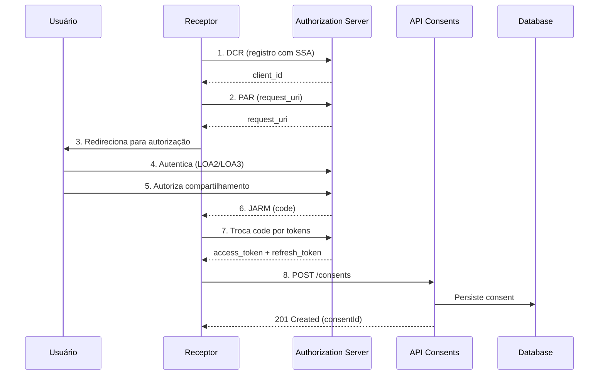
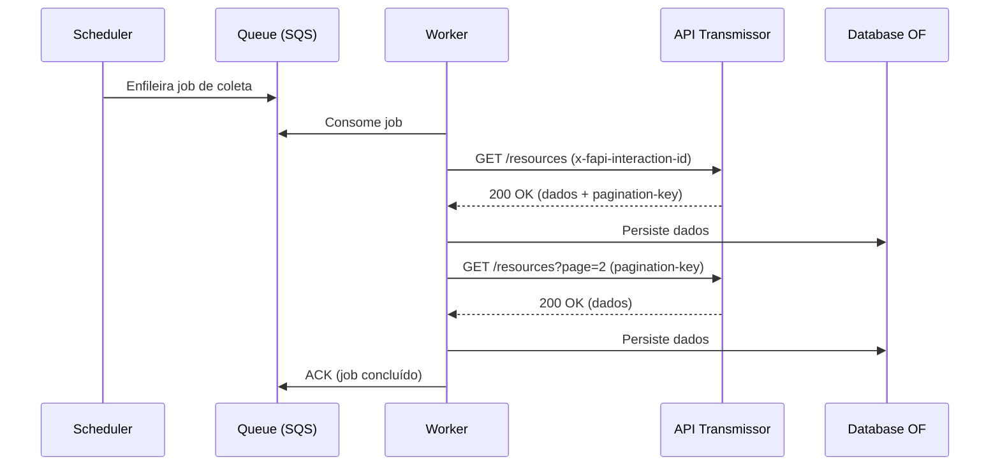

# Open Finance Brasil - Visão Geral do Projeto

## 1. Introdução

Este documento apresenta uma visão consolidada do projeto **Open Finance Brasil**, que implementa uma solução completa para atuar tanto como **Transmissor de Dados (Data Holder)** quanto **Receptor de Dados (Data Recipient)** dentro do ecossistema Open Finance Brasil.

O projeto foi estruturado para atender integralmente às especificações técnicas e regulatórias definidas pelo **Open Finance Brasil**, incluindo requisitos de segurança FAPI-BR, registro dinâmico de clientes (DCR), APIs de compartilhamento de dados e requisitos não-funcionais de performance e disponibilidade.

---

## 2. Contexto e Objetivos

### 2.1 Contexto de Negócio

O **Open Finance Brasil** representa uma evolução do sistema financeiro brasileiro, permitindo que clientes autorizem o compartilhamento seguro de seus dados entre instituições financeiras participantes. Este modelo promove:

- **Autonomia do cliente** sobre seus dados financeiros
- **Inovação** através de novos produtos e serviços
- **Competitividade** no mercado financeiro
- **Transparência** nas relações instituição-cliente

### 2.2 Objetivos do Projeto

1. **Conformidade Regulatória**: atender 100% das especificações técnicas do Open Finance Brasil
2. **Segurança**: implementar o perfil FAPI-BR 1.0 com todas as extensões obrigatórias
3. **Performance**: cumprir as metas de p95 por classe de endpoint conforme regulação
4. **Escalabilidade**: suportar crescimento de volume com arquitetura cloud-native
5. **Observabilidade**: garantir visibilidade completa através de traces, logs e métricas
6. **Resiliência**: manter disponibilidade conforme SLA regulatório (≥95% diário, ≥99,5% trimestral)

---

## 3. Arquitetura de Alto Nível

### 3.1 Princípios Arquiteturais

- **Separação de Responsabilidades**: componentes dedicados para Transmissor e Receptor
- **Cloud-Native**: containerização, orquestração Kubernetes, infraestrutura como código
- **Event-Driven**: uso de mensageria (SNS/SQS) para comunicação assíncrona
- **API-First**: contratos OpenAPI como fonte de verdade
- **Security by Design**: mTLS, JOSE, FAPI-BR em todas as camadas

### 3.2 Componentes Principais

#### Camada Comum (Shared)
- **Auth Broker**: bibliotecas e SDK para integração com Authorization Server
- **Directory Connector**: integração com Diretório de Participants, validação SSA
- **Consent Core**: gestão de ciclo de vida de consentimentos
- **Data Access Gateway**: validação de tokens, escopos e roteamento
- **Observability Stack**: OpenTelemetry, correlação, métricas padronizadas

#### Transmissor (Holder)
- **Authorization Server**: Keycloak com extensões FAPI-BR
- **APIs de Compartilhamento de Dados**: Consents, Resources, Customers, Accounts
- **Monolith Adapter**: integração com sistemas legados
- **Quotas Service**: controle de limites operacionais e de tráfego
- **Discovery API**: Status, Outages, Metrics

#### Receptor (Recipient)
- **Client Gateway**: DCR, PAR/JAR/JARM, gestão de tokens
- **Collector Scheduler**: orquestração de coletas
- **Collector Worker**: execução de coletas paginadas
- **Normalizer**: normalização e enriquecimento de dados
- **Consent Monitor**: monitoramento de expirações e revalidações
- **Frontend**: interface React para gestão de conexões

---

## 4. Stack Tecnológica

### 4.1 Backend

| Componente | Tecnologia | Versão | Justificativa |
|-----------|-----------|---------|---------------|
| Runtime | Java | 25 | Virtual Threads para alta concorrência |
| Framework | Spring Boot | 3.x | Ecossistema maduro, suporte nativo a OIDC/OAuth2 |
| Authorization Server | Keycloak | latest | Extensível para FAPI-BR, suporte a DCR |
| Database (Relacional) | PostgreSQL | 16+ | ACID, extensibilidade, performance |
| Database (Documento) | MongoDB | 7+ | Flexibilidade para dados Open Finance variáveis |
| Cache | Redis | 7+ | JWKS cache, throttling, idempotência |
| Mensageria | AWS SNS/SQS | - | Event-driven, desacoplamento |

### 4.2 Frontend

| Componente | Tecnologia | Justificativa |
|-----------|-----------|---------------|
| Framework | React | Ecossistema rico, componentização |
| Build Tool | Vite | Performance, DX moderna |
| State Management | Context API / Zustand | Simplicidade, escalável |

### 4.3 Infraestrutura

| Componente | Tecnologia | Justificativa |
|-----------|-----------|---------------|
| Orquestração | Kubernetes (EKS) | Padrão de mercado, cloud-agnostic |
| IaC | Terraform | Declarativo, state management |
| Package Manager | Helm | Versionamento, templates |
| Observabilidade | OpenTelemetry + Datadog/Prometheus | Padrão CNCF, vendor-neutral |
| CI/CD | GitHub Actions / GitLab CI | Integração nativa, flexível |

---

## 5. Fluxos Principais

### 5.1 Fluxo de Consentimento (Transmissor)

### 5.2 Fluxo de Coleta (Receptor)

---

## 6. Requisitos Não-Funcionais

### 6.1 Performance

| Classe de Endpoint | p95 (ms) | Regulatório |
|-------------------|----------|-------------|
| Alta Frequência | ≤ 1.500 | ✅ |
| Média-Alta Frequência | ≤ 1.500 | ✅ |
| Média Frequência | ≤ 2.000 | ✅ |
| Baixa Frequência | ≤ 4.000 | ✅ |

**Meta Interna**: p99 < 2x p95 por classe

### 6.2 Disponibilidade

- **Diária**: ≥ 95%
- **Trimestral**: ≥ 99,5%
- **Aferição**: GET `/discovery/status` a cada 30s (timeout 1s)
- **Estados**: OK, PARTIAL_FAILURE, SCHEDULED_OUTAGE, UNAVAILABLE

### 6.3 Limites de Tráfego

#### TPM (Transactions Per Minute)
- **Alta Frequência**: conforme tabela QCA/consentimentos ativos
- **Média-Alta**: 2.000 TPM
- **Média**: 1.500 TPM
- **Baixa**: 1.000 TPM
- **Violação**: HTTP 429 (Too Many Requests)

#### TPS (Transactions Per Second)
- **Mínimo**: 300 TPS simultâneos
- **Scale-up**: +150 TPS ao atingir limite
- **Violação**: HTTP 529 (Site is Overloaded)

### 6.4 Limites Operacionais (Mensais)

| Classe | Chamadas/Mês | HTTP ao Exceder |
|--------|--------------|-----------------|
| Baixa | 8 | 423 |
| Média | 30 | 423 |
| Média-Alta | 120 | 423 |
| Alta | 240 | 423 |
| Saldos/Limites Contas | 420 | 423 |

**Regras**:
- Apenas respostas 2xx contam
- `x-fapi-interaction-id` obrigatório
- `pagination-key` exclui rechamadas do limite

### 6.5 Timeout

- **Server-side**: 15 segundos
- **HTTP ao Exceder**: 504 (Gateway Timeout)

---

## 7. Segurança

### 7.1 FAPI-BR 1.0

Implementação completa do perfil de segurança:

- ✅ **PAR (Pushed Authorization Request)**: obrigatório
- ✅ **JAR (JWT-Secured Authorization Request)**: request assinado
- ✅ **JARM (JWT-Secured Authorization Response Mode)**: response assinado
- ✅ **mTLS**: bound tokens, certificados ICP-Brasil
- ✅ **private_key_jwt**: autenticação de client
- ✅ **JOSE**: assinatura (PS256) e criptografia
- ✅ **acr**: LOA2 obrigatório, LOA3 recomendado
- ✅ **Token Lifetimes**: access 300-900s, refresh sem rotação

### 7.2 DCR (Dynamic Client Registration)

- **SSA (Software Statement Assertion)**: assinado PS256 pelo Diretório
- **Validações**: `iat` ≤ 5 minutos, `jwks_uri`, `redirect_uris`
- **mTLS**: certificado ICP-Brasil na conexão
- **Registro**: criação/atualização/consulta de clients

### 7.3 Headers Obrigatórios

| Header | Quando | Descrição |
|--------|--------|-----------|
| `x-fapi-interaction-id` | Chamadas autenticadas | UUID RFC4122 para correlação |
| `Authorization` | APIs protegidas | Bearer token |
| `x-pagination-key` | Paginação | Exclui rechamada de limite operacional |

---

## 8. Observabilidade

### 8.1 Traces

- **Propagação**: W3C Trace Context
- **Correlação**: `x-fapi-interaction-id` em spans
- **Instrumentação**: OpenTelemetry auto-instrumentation

### 8.2 Métricas

**Aplicação**:
- Requests per second (RPS) por endpoint
- Latência (p50, p95, p99)
- Taxa de erro por código HTTP
- Timeouts
- Cache hit/miss ratio

**Infraestrutura**:
- CPU/Memory por pod
- Network I/O
- Disk I/O
- Queue depth (SQS)

### 8.3 Logs

- **Formato**: JSON estruturado
- **Campos obrigatórios**: `timestamp`, `level`, `requestId`, `consentId`, `clientId`, `softwareId`
- **Sensibilidade**: sem dados pessoais ou credenciais

### 8.4 PCM (Plataforma de Coleta de Métricas)

Exportação regulatória de métricas:
- Disponibilidade por endpoint
- Latência por endpoint
- Taxa de erro por código
- Volume de transações

---

## 9. Ambientes

| Ambiente | Finalidade | Dados | Infra |
|----------|-----------|-------|-------|
| **Dev** | Desenvolvimento local | Mock/Sintético | Docker Compose |
| **QA** | Testes integrados | Sintético | Kubernetes (small) |
| **Sandbox** | Conformidade BR-OB | Sintético | Kubernetes (medium) |
| **Prod** | Operação real | Real | Kubernetes (HA) |

---

## 10. Governança e Conformidade

### 10.1 Certificações Obrigatórias

- **FAPI-BR OP (OpenID Provider)**: Authorization Server
- **FAPI-BR RP (Relying Party)**: Client Gateway
- **FAPI-BR DCR**: Registro dinâmico
- **Conformidade Funcional**: APIs de Dados

### 10.2 Auditorias

- Logs imutáveis (retention 5 anos)
- Trilha de consentimentos
- Trilha de acessos a dados
- Trilha de DCR/tokens

### 10.3 Gestão de Incidentes

- **Severidade 1**: indisponibilidade total (< 1h de resposta)
- **Severidade 2**: degradação severa (< 4h)
- **Severidade 3**: degradação leve (< 24h)
- **Severidade 4**: melhorias (backlog)

---

## 11. Próximos Passos

Este documento de visão geral serve como ponto de partida. Para aprofundamento, consulte:

- **`docs/common/`**: documentação da camada compartilhada (Keycloak, DCR, Observabilidade, PCM)
- **`docs/holder/`**: documentação específica do Transmissor
- **`docs/recipient/`**: documentação específica do Receptor
- **`apps/*/README.md`**: documentação técnica por componente

---

## 12. Glossário Rápido

| Termo | Significado |
|-------|-------------|
| **Transmissor (Holder)** | Instituição que expõe dados mediante consentimento |
| **Receptor (Recipient)** | Instituição que consome dados autorizados |
| **DCR** | Dynamic Client Registration |
| **SSA** | Software Statement Assertion |
| **FAPI** | Financial-grade API |
| **PAR** | Pushed Authorization Request |
| **JAR** | JWT-Secured Authorization Request |
| **JARM** | JWT-Secured Authorization Response Mode |
| **mTLS** | Mutual TLS |
| **PCM** | Plataforma de Coleta de Métricas |
| **LOA** | Level of Assurance (nível de garantia de autenticação) |
| **OAS** | OpenAPI Specification |

---

## 13. Referências

- [Open Finance Brasil - Área do Desenvolvedor](https://openfinancebrasil.org.br)
- [FAPI-BR Security Profile](https://openfinancebrasil.atlassian.net/wiki/spaces/OF/pages/245694465)
- [DCR Specification](https://openfinancebrasil.atlassian.net/wiki/spaces/OF/pages/246054957)
- [API Comum (Discovery)](https://openfinancebrasil.atlassian.net/wiki/spaces/OF/pages/429654037)
- [Requisitos Não-Funcionais](https://openfinancebrasil.atlassian.net/wiki/spaces/OF/pages/17891396)

---

**Última atualização**: Novembro 2025  
**Versão do documento**: 1.0  
**Mantido por**: Equipe de Arquitetura Open Finance
